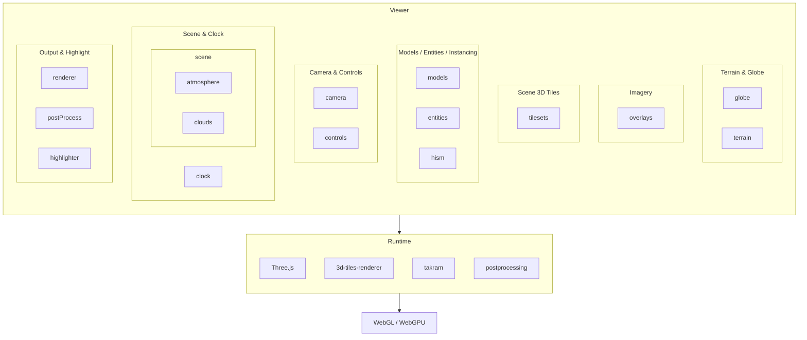

# Tellux

[中文](./README.md) | English

[](https://www.npmjs.com/package/tellux) [](https://www.npmjs.com/package/tellux) [](LICENSE) []()

Tellux is an open-source 3D Earth engine for the web. Use it to build digital globes, digital twins, 3D maps, and other 3D Earth applications on real geographic coordinates and physical scale.

It builds on Three.js rendering and the broader open-source ecosystem, integrating mature community projects (see [Acknowledgments](#-acknowledgments)) into a unified API for globe cameras, Cesium Quantized Mesh terrain, multi-source imagery and vector layers, 3D Tiles, 3D models, atmospheric sky, volumetric clouds, and post-processing. Developers can focus on modern web apps ranging from lightweight visualization to complex 3D Earth scenes.


---

[🌐 Examples](https://tellux.cyanfish.site) | [📚 Docs](https://tellux.cyanfish.site/docs/) | [🧪 Sandcastle](https://tellux.cyanfish.site/sandcastle.html) | [💻 GitHub](https://github.com/cyanfish-x/tellux)

---

## 🚀 Quick start

### Install

Tellux is an ESM package. When using a module bundler such as Vite, Webpack, or Rollup, install Tellux and its peer dependencies:

```bash
npm install tellux three 3d-tiles-renderer @takram/three-geospatial @takram/three-geospatial-effects @takram/three-atmosphere @takram/three-clouds postprocessing
```

Install optional dependencies when using MVT vector tiles:

```bash
npm install @mapbox/vector-tile pbf
```

### Next steps

- Read the [Getting Started guide](https://tellux.cyanfish.site/docs/guide/getting-started) for Draco decoders, asset paths, and Viewer lifecycle.
- Explore the [guides](https://tellux.cyanfish.site/docs/guide/viewer) for cameras, interaction, terrain, imagery, 3D Tiles, models, entities, atmosphere, and post-processing.
- Browse and edit runnable examples in [Sandcastle](https://tellux.cyanfish.site/sandcastle.html).
- Consult the [Viewer API](https://tellux.cyanfish.site/docs/api/viewer) and [type reference](https://tellux.cyanfish.site/docs/api/types).
- Interested in contributing? Read the [Contributing Guide](CONTRIBUTING.en.md), then open an issue or pull request. Commit messages follow [Conventional Commits](https://www.conventionalcommits.org/en/v1.0.0/).

## ✨ Features

- **Terrain & Imagery**: Cesium Quantized Mesh terrain, XYZ, WMS, WMTS, Cesium Ion imagery, and draped GeoJSON / MVT vector layers.
- **Entity**: Point, polyline, and polygon graphics, plus screen-space icons and text labels; clamp to terrain and 3D Tiles, extrude polygons, and take part in picking and order-independent transparency.
- **3D Tiles & Gaussian Splatting**: Load URL or Cesium Ion 3D Tiles, glTF / GLB models with animation, and 3D Gaussian Splatting scenes.
- **Atmosphere & Rendering Effects**: Atmospheric sky, aerial perspective, volumetric clouds, day-night lighting, SMAA, lens flare, and other advanced effects.
- **Native Three.js interop**: Works with Three.js scenes, objects, coordinate conversion, and custom render loops.
- **WebGL & WebGPU**: WebGL by default, plus an experimental WebGPU path for the base globe, terrain, imagery, 3D Tiles, models, atmosphere, and some post-processing.

## 🌍 Data sources

Tellux is a runtime and rendering engine for 3D Earth apps. It does not bind to or host base geospatial data. Combine freely:

- Cesium Quantized Mesh terrain
- XYZ / WMS / WMTS imagery
- GeoJSON / MVT vector data
- 3D Tiles scenes
- glTF / GLB models
- 3D Gaussian Splatting scenes

## 🧩 Architecture

Tellux is not a simple globe widget; it is an engine layer for 3D Earth applications.



## 🌱 Acknowledgments

Tellux is built on these open-source projects, with thanks to all contributors:

- [Three.js](https://github.com/mrdoob/three.js)
- [@takram/three-geospatial](https://github.com/takram-design-engineering/three-geospatial)
- [@takram/three-atmosphere](https://github.com/takram-design-engineering/three-atmosphere)
- [@takram/three-clouds](https://github.com/takram-design-engineering/three-clouds)
- [3D Tiles Renderer](https://github.com/NASA-AMMOS/3DTilesRendererJS)
- [postprocessing](https://github.com/pmndrs/postprocessing)

Thanks to everyone advancing the modern Web 3D ecosystem, and to every developer who keeps sharing and creating. ❤️

## ⚖️ License

[MIT](./LICENSE). Tellux is free for commercial and non-commercial use.
