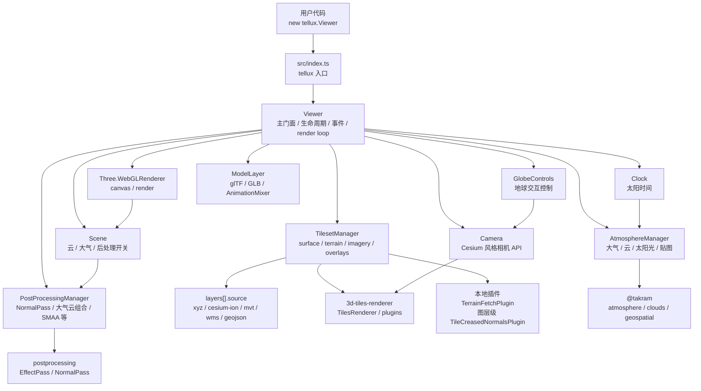
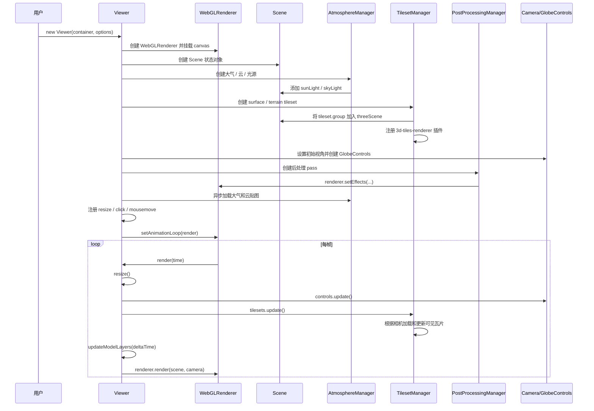

# Tellux

[English](./README.en.md) | 中文

Tellux 是一个基于 Three.js 的三维地理空间引擎，用 Three.js 构建数字地球、地形、影像与 3D Tiles 场景。

在线预览：https://tellux.cyanfish.site

## 安装

```bash
npm install tellux three 3d-tiles-renderer postprocessing @takram/three-atmosphere @takram/three-clouds @takram/three-geospatial @takram/three-geospatial-effects @mapbox/vector-tile pbf
```

## 使用

```ts
import tellux from 'tellux'

const viewer = new tellux.Viewer('viewer', {
  terrain: {
    url: 'https://example.com/terrain/'
  },
  layers: [
    {
      source: {
        type: 'xyz',
        url: 'https://example.com/imagery/{z}/{y}/{x}.png'
      }
    }
  ],
  camera: {
    latitude: 35.6812,
    longitude: 139.8,
    height: 500
  }
})
```

`terrain.url` 支持 Cesium quantized-mesh 地形根目录，也可以直接传入 `layer.json` 地址。运行时可以热切换地形：

```ts
viewer.setTerrain({
  url: 'https://example.com/another-terrain/layer.json'
})

viewer.setTerrain(null)
```

也可以使用 Cesium Ion 影像数据源：

```ts
new tellux.Viewer(container, {
  layers: [
    {
      source: {
        type: 'cesium-ion',
        assetId: 123456,
        apiToken: import.meta.env.VITE_CESIUM_ION_TOKEN
      }
    }
  ]
})
```

`layers` 中的 `type: 'cesium-ion'` 用于 Cesium Ion 影像资源。Google Photorealistic 3D Tiles 这类 3D Tiles 资源应通过 `viewer.load3DTileset(...)` 加载：

```ts
const photorealisticLayer = viewer.load3DTileset({
  type: 'cesium-ion',
  assetId: 2275207,
  apiToken: import.meta.env.VITE_CESIUM_ION_TOKEN
})

// 作为全球三维底图使用时，可隐藏默认基础地球表面，避免与摄影测量网格重叠。
viewer.tileset.group.visible = false
```

影像图层统一通过 `viewer.layers` 管理，图层顺序按数组从下到上绘制：

```ts
const imageryLayer = viewer.layers.add({
  name: 'World Imagery',
  source: {
    type: 'xyz',
    url: 'https://example.com/imagery/{z}/{y}/{x}.png'
  }
})

imageryLayer.setVisible(false)
imageryLayer.setStyle({ opacity: 0.65 })
imageryLayer.moveTo(0)
imageryLayer.remove()
```

MVT 矢量瓦片可以作为影像图层接入：

```ts
viewer.layers.add({
  name: 'Water and roads',
  source: {
    type: 'mvt',
    url: 'https://example.com/tiles/{z}/{x}/{y}.pbf'
  },
  style: {
    getStyle(layerName) {
      if (layerName.includes('water')) return { fill: '#38bdf8', order: 10 }
      if (layerName.includes('transportation')) return { stroke: '#facc15', strokeWidth: 1.4, order: 30 }
      return null
    }
  }
})
```

MVT 图层依赖 `3d-tiles-renderer` 的 MVT overlay 能力，运行时需要安装 `@mapbox/vector-tile` 和 `pbf`。

GeoJSON 可以作为贴地矢量 overlay 接入：

```ts
viewer.layers.add({
  name: 'Area boundary',
  source: {
    type: 'geojson',
    url: '/data/boundary.geojson'
  },
  style: {
    opacity: 0.85,
    fill: 'rgba(20, 184, 166, 0.28)',
    stroke: '#14b8a6',
    strokeWidth: 2,
    getStyle(feature, properties) {
      if (properties?.kind === 'restricted') return { fill: 'rgba(244, 63, 94, 0.32)', stroke: '#f43f5e' }
      return {}
    }
  }
})
```

也可以直接传入 GeoJSON 对象：

```ts
viewer.layers.add({
  source: {
    type: 'geojson',
    geojson
  }
})
```

WMS 服务可以作为影像图层接入：

```ts
viewer.layers.add({
  name: 'Province boundary',
  source: {
    type: 'wms',
    url: 'https://example.com/geoserver/wms',
    layer: 'workspace:layer',
    crs: 'EPSG:4326',
    format: 'image/png',
    transparent: true
  },
  style: {
    opacity: 0.7
  }
})
```

例如 GeoServer WMS 1.1.0 服务：

```ts
viewer.layers.add({
  name: '中国省界 WMS',
  source: {
    type: 'wms',
    url: 'https://example.com/geoserver/wms',
    layer: 'workspace:province_boundary',
    version: '1.1.0',
    crs: 'EPSG:4326',
    styles: '',
    format: 'image/png',
    transparent: true,
    contentBoundingBox: [73.501142, 3.397162, 135.088511, 53.560901]
  },
  style: {
    opacity: 0.72
  }
})
```

> WMS 图层应请求图片格式，例如 `image/png`。`format=application/openlayers` 通常是 GeoServer 的预览页格式，不适合作为影像贴图。

## glTF / GLB 模型

可以通过 `viewer.addModel(...)` 加载普通 glTF 或 GLB 模型，并直接按经纬高放置到 Tellux 场景中。`coordinates` 支持 `[经度, 纬度, 高度]` 数组，也支持 `{ longitude, latitude, height }` 对象；高度单位为米。

```ts
const model = viewer.addModel({
  type: 'gltf',
  id: 'littlest-tokyo',
  url: 'https://threejs.org/examples/models/gltf/LittlestTokyo.glb',
  coordinates: [114, 30, 0],
  scale: 0.45,
  heading: 180,
  alignToGround: true,
  animate: true,
  animationChannel: 0
})

await model.ready

viewer.flyToTarget(model.root, {
  heading: -35,
  pitch: -28,
  distance: 2600
})

model.playAnimation(0)
model.pauseAnimation()
model.stopAnimation()
model.remove()
```

`type` 固定为 `'gltf'`，URL 可以指向 `.gltf` 或 `.glb`。当 `animate: true` 时，模型加载完成后默认播放第 `0` 个动画通道；可以用 `animationChannel` 指定其他通道。

如果你需要自己放置 Three.js 对象，也可以复用 Tellux 的坐标转换 API：

```ts
const position = viewer.cartographicToVector3([114, 30, 100])

const matrix = viewer.cartographicToMatrix4([114, 30, 0], {
  heading: 90,
  pitch: 0,
  roll: 0
})

object.matrixAutoUpdate = false
object.matrix.copy(matrix)
viewer.scene.threeScene.add(object)
```

`cartographicToVector3(...)` 返回底层 Three.js 世界坐标；`cartographicToMatrix4(...)` 返回适合 Three.js 对象的当地坐标矩阵，`+Y` 指向当地上方，`+Z` 指向对象前方。

## 光照模式

Tellux 提供两种大气光照模式，默认使用 `light-source`：

```ts
const viewer = new tellux.Viewer(container, {
  scene: {
    atmosphere: {
      lighting: {
        mode: 'light-source'
      }
    }
  }
})
```

`light-source` 会在 Three.js 场景中使用 Takram 的太阳方向光和天空光探针。它适合大多数 3D GIS 场景：3D Tiles、地形、overlay 影像、自定义 Three.js 模型和 PBR 材质都可以沿用 Three.js 的常规受光方式。可以通过 `scene.atmosphere.lighting` 调整光源强度：

```ts
viewer.scene.atmosphere.lighting.mode = 'light-source'
viewer.scene.atmosphere.lighting.sunLight = true
viewer.scene.atmosphere.lighting.skyLight = true
viewer.scene.atmosphere.lighting.sunLightIntensity = 1.2
viewer.scene.atmosphere.lighting.skyLightIntensity = 0.8
```

`post-process` 是 Takram 的原生空气透视后处理光照路径。它会把渲染结果当作表面反照率（albedo），再在 `AerialPerspectiveEffect` 中应用太阳光、天空光、大气透射和空气散射。这个模式适合想获得更统一的大气后处理效果的高级场景，但输入材质应是不受 Three.js 光源影响的 albedo 材质，例如 `MeshBasicMaterial` 或 glTF 的 `KHR_materials_unlit`。

加载 3D Tiles 时，如果数据本身不是 unlit 材质，但希望它参与 `post-process` 光照，可以显式使用 `materialMode: 'unlit'`：

```ts
viewer.scene.atmosphere.lighting.mode = 'post-process'
viewer.scene.atmosphere.lighting.sunLight = true
viewer.scene.atmosphere.lighting.skyLight = true
viewer.scene.atmosphere.lighting.albedoScale = 0.6

const layer = viewer.load3DTileset({
  type: 'url',
  url: 'https://example.com/tileset.json',
  materialMode: 'unlit'
})
```

如果在 `post-process` 模式下仍使用 PBR 或其他受光材质，场景中的 Three.js 光源会被关闭，瓦片在进入后处理前可能已经变暗甚至变黑。此时要么改用默认的 `light-source`，要么为需要后处理光照的 3D Tiles 使用 `materialMode: 'unlit'`。

请确保容器具有非零尺寸：

```css
#viewer {
  width: 100vw;
  height: 100vh;
}
```

## Draco 解码器

Tellux 使用 `DRACOLoader` 加载 glTF tiles 和 glTF / GLB 模型。默认情况下，解码器会从 `/draco/gltf/` 加载。

你可以将 `three/examples/jsm/libs/draco/gltf/` 中的解码器文件复制到应用的 public 目录，或传入自定义路径：

```ts
new Viewer(container, {
  dracoDecoderPath: '/assets/draco/gltf/'
})
```

## 静态资源目录

Tellux 默认会从上游资源地址加载云、STBN 和星空资源。内网部署时，可以把
`local_weather.png`、`turbulence.png`、`shape.bin`、`shape_detail.bin`、`stbn.bin` 和 `stars.bin`
放到自己的静态目录，并在创建 Viewer 前设置 `tellux.baseUrl`：

```ts
import tellux from 'tellux'

tellux.baseUrl = '/assets/tellux/'

new tellux.Viewer(container)
```

## API

```ts
viewer.camera.setView({
  latitude: 31.2304,
  longitude: 121.4737,
  height: 1000,
  heading: -90,
  pitch: -15
})

viewer.flyToTarget({
  latitude: 31.2304,
  longitude: 121.4737,
  height: 0
}, {
  heading: -90,
  pitch: -30,
  distance: 1200
})

const layer = viewer.load3DTileset({
  type: 'url',
  url: 'https://example.com/tileset.json'
})

viewer.flyToTarget(layer.tileset, {
  heading: 0,
  pitch: -30
})

const model = viewer.addModel({
  type: 'gltf',
  url: '/models/site.glb',
  coordinates: [121.4737, 31.2304, 0],
  animate: true
})

await model.ready
viewer.flyToTarget(model.root)

viewer.scene.clouds.show = false
viewer.scene.atmosphere.show = true
viewer.scene.postProcess.smaa.enabled = true
viewer.toneMappingExposure = 8
viewer.resolutionScale = 1.5

viewer.destroy()
```

## 项目架构

Tellux 采用 `Viewer` 门面加多个内部 manager 协作的结构。用户侧只需要面对 `Viewer`、`Camera`、`Scene`、`Clock` 和资源配置对象；复杂的瓦片、地形、影像、大气、云和后处理逻辑由内部模块分工管理。



主要模块职责：

- `Viewer`：主入口和门面类，负责创建 renderer、scene、camera、clock、controls，提供 glTF / GLB 模型加载入口，并协调各 manager 的生命周期。
- `Camera`：封装 Cesium 风格的 `setView`、`flyTo` 和当前视角读取。
- `Scene`：保存云、大气、后处理等场景状态，并在状态变化时触发后处理重组。
- `TilesetManager`：创建和热切换基础地球表面、quantized-mesh 地形、影像底图和影像叠加层。
- `ModelLayer`：由 `viewer.addModel(...)` 创建，管理 glTF / GLB 模型、动画通道、显隐和资源释放。
- `AtmosphereManager`：创建大气、云、太阳光、天空光，并加载云纹理和 STBN 资源。
- `PostProcessingManager`：根据 `Scene` 状态组合 normal pass、大气云 pass、SMAA、dithering 和 lens flare。

## 渲染流程

从 `new tellux.Viewer(container, options)` 到画面渲染出来，大致会经历以下流程：



运行时，`Viewer` 只负责串联流程：先同步容器尺寸，再更新地球控制器，然后让 `TilesetManager` 推进瓦片加载与 LOD 更新，接着更新已加载模型的动画，最后交给 Three.js renderer 渲染当前场景。影像、地形和叠加层切换时，`Viewer` 会转发给 `TilesetManager`；云、大气和后处理开关变化时，`Scene` 会触发 `PostProcessingManager` 重新组合渲染效果。
