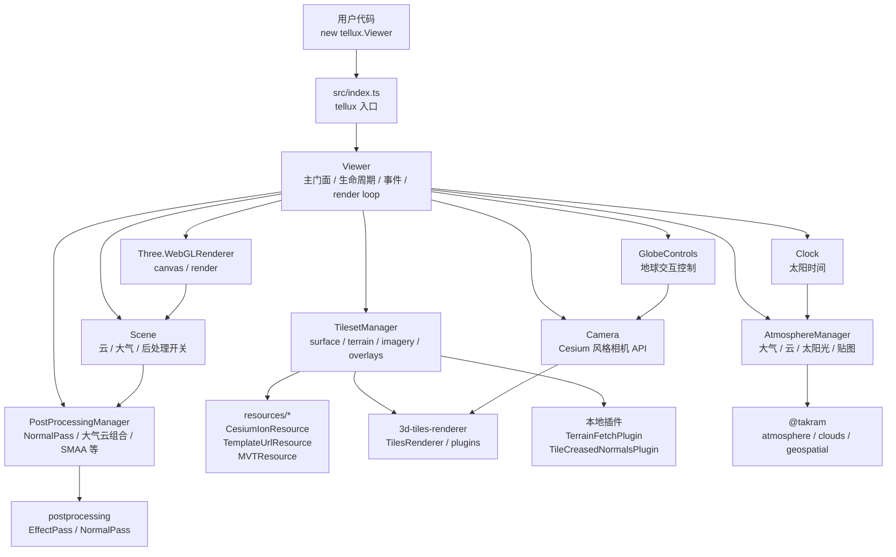
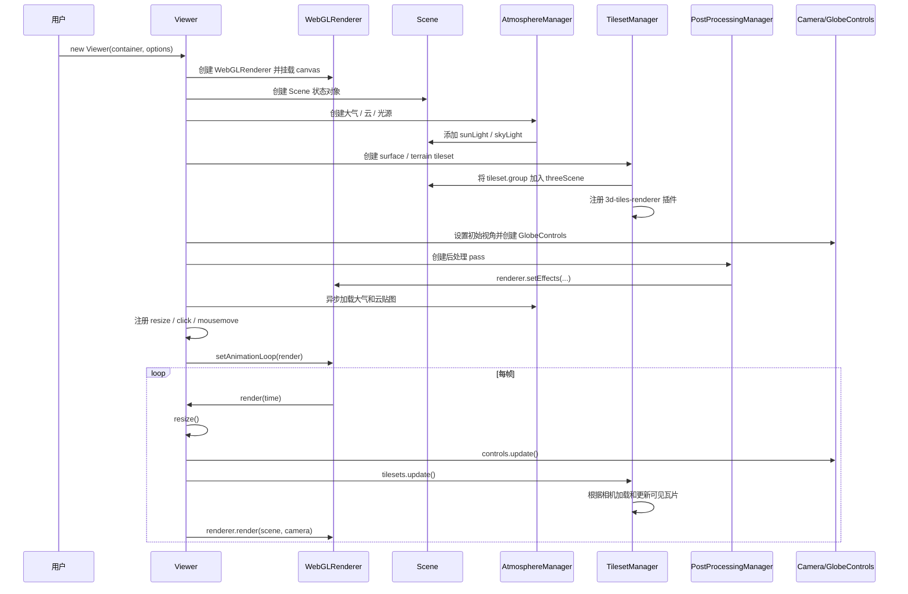

# Tellux

[English](./README.en.md) | 中文

Tellux 是一个基于 Three.js 的三维地理空间引擎，用 Three.js 构建数字地球、地形、影像与 3D Tiles 场景。

## 安装

```bash
npm install tellux three 3d-tiles-renderer postprocessing @takram/three-atmosphere @takram/three-clouds @takram/three-geospatial @takram/three-geospatial-effects @mapbox/vector-tile pbf
```

## 使用

```ts
import tellux from 'tellux'

const container = document.querySelector('#viewer') as HTMLElement

const viewer = new tellux.Viewer(container, {
  terrain: {
    url: 'https://example.com/terrain/'
  },
  layers: [
    {
      source: tellux.TemplateUrlResource.fromUrl(
        'https://server.arcgisonline.com/ArcGIS/rest/services/World_Imagery/MapServer/tile/{z}/{y}/{x}'
      )
    }
  ],
  camera: {
    latitude: 35.6812,
    longitude: 139.8,
    height: 500
  }
})
```

`terrain.url` 支持 Cesium quantized-mesh 地形根目录，也可以直接传入 `layer.json` 地址。运行时可以热切换地形：

```ts
viewer.setTerrain({
  url: 'https://example.com/another-terrain/layer.json'
})

viewer.setTerrain(null)
```

也可以继续使用 Cesium Ion 资源：

```ts
new tellux.Viewer(container, {
  layers: [
    {
      source: tellux.CesiumIonResource.fromAssetId(2275207, {
        apiToken: import.meta.env.VITE_CESIUM_ION_TOKEN
      })
    }
  ]
})
```

影像图层统一通过 `viewer.layers` 管理，图层顺序按数组从下到上绘制：

```ts
const imageryLayer = viewer.layers.add({
  name: 'World Imagery',
  source: tellux.TemplateUrlResource.fromUrl(
    'https://server.arcgisonline.com/ArcGIS/rest/services/World_Imagery/MapServer/tile/{z}/{y}/{x}'
  )
})

imageryLayer.setVisible(false)
imageryLayer.setStyle({ opacity: 0.65 })
imageryLayer.moveTo(0)
imageryLayer.remove()
```

MVT 矢量瓦片可以通过 `MVTResource` 作为影像图层接入：

```ts
viewer.layers.add({
  name: 'Water and roads',
  source: tellux.MVTResource.fromUrl('https://example.com/tiles/{z}/{x}/{y}.pbf', {
    getStyle(layerName) {
      if (layerName.includes('water')) return { fill: '#38bdf8', order: 10 }
      if (layerName.includes('transportation')) return { stroke: '#facc15', strokeWidth: 1.4, order: 30 }
      return null
    }
  })
})
```

`MVTResource` 依赖 `3d-tiles-renderer` 的 MVT overlay 能力，运行时需要安装 `@mapbox/vector-tile` 和 `pbf`。

WMS 服务可以通过 `WMSResource` 作为影像图层接入：

```ts
viewer.layers.add({
  name: 'Province boundary',
  source: tellux.WMSResource.fromUrl('https://example.com/geoserver/wms', 'workspace:layer', {
    crs: 'EPSG:4326',
    format: 'image/png',
    transparent: true
  }),
  style: {
    opacity: 0.7
  }
})
```

例如 GeoServer WMS 1.1.0 服务：

```ts
viewer.layers.add({
  name: '中国省界 WMS',
  source: tellux.WMSResource.fromUrl('http://localhost:8080/geoserver/YX_yimin/wms', 'YX_yimin:china_province', {
    version: '1.1.0',
    crs: 'EPSG:4326',
    styles: '',
    format: 'image/png',
    transparent: true,
    contentBoundingBox: [73.501142, 3.397162, 135.088511, 53.560901]
  }),
  style: {
    opacity: 0.72
  }
})
```

> WMS 图层应请求图片格式，例如 `image/png`。`format=application/openlayers` 通常是 GeoServer 的预览页格式，不适合作为影像贴图。

请确保容器具有非零尺寸：

```css
#viewer {
  width: 100vw;
  height: 100vh;
}
```

## Draco 解码器

Tellux 使用 `DRACOLoader` 加载 glTF tiles。默认情况下，解码器会从 `/draco/gltf/` 加载。

你可以将 `three/examples/jsm/libs/draco/gltf/` 中的解码器文件复制到应用的 public 目录，或传入自定义路径：

```ts
new Viewer(container, {
  dracoDecoderPath: '/assets/draco/gltf/'
})
```

## 静态资源目录

Tellux 默认会从上游资源地址加载云和 STBN 纹理。内网部署时，可以把
`local_weather.png`、`turbulence.png`、`shape.bin`、`shape_detail.bin` 和 `stbn.bin`
放到自己的静态目录，并在创建 Viewer 前设置 `tellux.baseUrl`：

```ts
import tellux from 'tellux'

tellux.baseUrl = '/assets/tellux/'

new tellux.Viewer(container)
```

## API

```ts
viewer.camera.setView({
  latitude: 31.2304,
  longitude: 121.4737,
  height: 1000,
  heading: -90,
  pitch: -15
})

viewer.flyToTarget({
  latitude: 31.2304,
  longitude: 121.4737,
  height: 0
}, {
  heading: -90,
  pitch: -30,
  distance: 1200
})

const layer = viewer.load3DTileset({
  type: 'url',
  url: 'https://example.com/tileset.json'
})

viewer.flyToTarget(layer.tileset, {
  heading: 0,
  pitch: -30
})

viewer.scene.clouds.show = false
viewer.scene.skyAtmosphere.show = true
viewer.scene.postProcessStages.smaa.enabled = true
viewer.toneMappingExposure = 8
viewer.resolutionScale = 1.5

viewer.destroy()
```

## 项目架构

Tellux 采用 `Viewer` 门面加多个内部 manager 协作的结构。用户侧只需要面对 `Viewer`、`Camera`、`Scene`、`Clock` 和资源配置对象；复杂的瓦片、地形、影像、大气、云和后处理逻辑由内部模块分工管理。



主要模块职责：

- `Viewer`：主入口和门面类，负责创建 renderer、scene、camera、clock、controls，并协调各 manager 的生命周期。
- `Camera`：封装 Cesium 风格的 `setView`、`flyTo` 和当前视角读取。
- `Scene`：保存云、大气、后处理等场景状态，并在状态变化时触发后处理重组。
- `TilesetManager`：创建和热切换基础地球表面、quantized-mesh 地形、影像底图和影像叠加层。
- `AtmosphereManager`：创建大气、云、太阳光、天空光，并加载云纹理和 STBN 资源。
- `PostProcessingManager`：根据 `Scene` 状态组合 normal pass、大气云 pass、SMAA、dithering 和 lens flare。
- `resources/*`：资源配置工厂目录，后续可继续扩展 WMS、GeoJSON、PMTiles 等资源类型。

## 渲染流程

从 `new tellux.Viewer(container, options)` 到画面渲染出来，大致会经历以下流程：



运行时，`Viewer` 只负责串联流程：先同步容器尺寸，再更新地球控制器，然后让 `TilesetManager` 推进瓦片加载与 LOD 更新，最后交给 Three.js renderer 渲染当前场景。影像、地形和叠加层切换时，`Viewer` 会转发给 `TilesetManager`；云、大气和后处理开关变化时，`Scene` 会触发 `PostProcessingManager` 重新组合渲染效果。
