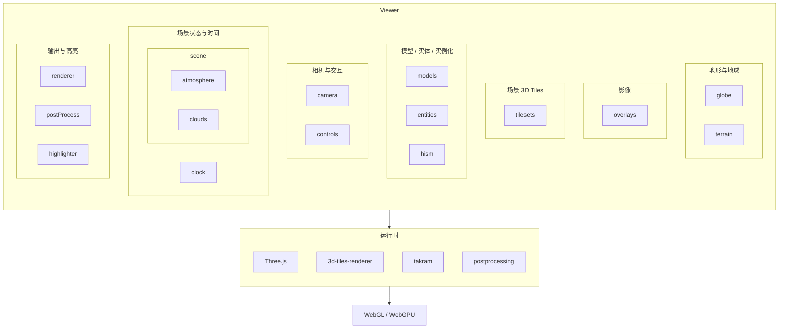

# Tellux

中文 | [English](./README.en.md)

[](https://www.npmjs.com/package/tellux) [](https://www.npmjs.com/package/tellux) [](LICENSE) []()

Tellux 是面向 Web 的开源三维地球引擎，用于在浏览器中快速构建基于真实经纬坐标系和物理尺度的数字地球、数字孪生、三维地图等各类 3D Earth 应用。

它建立在 Three.js 强大的渲染能力与丰富的开源生态之上，通过整合社区成熟开源项目能力（详见 [开源致谢](#-开源致谢)），提供统一的 API 来组织地球相机、Cesium Quantized Mesh 地形、多源影像与矢量图层、3D Tiles、三维模型、天空大气、体积云及后处理效果，让开发者能够专注于构建从轻量级可视化到复杂三维地球场景的现代 Web 应用。


---

[🌐 示例](https://tellux.cyanfish.site) | [📚 文档](https://tellux.cyanfish.site/docs/) | [🧪 Sandcastle](https://tellux.cyanfish.site/sandcastle.html) | [💻 GitHub](https://github.com/cyanfish-x/tellux)

---

## 🚀 快速开始

### 安装

Tellux 是 ESM 包。使用 Vite、Webpack、Rollup 等模块打包器时，需要同时安装 Tellux 及其 peer 依赖：

```bash
npm install tellux three 3d-tiles-renderer @takram/three-geospatial @takram/three-geospatial-effects @takram/three-atmosphere @takram/three-clouds postprocessing
```

使用 MVT 矢量瓦片时，再安装可选依赖：

```bash
npm install @mapbox/vector-tile pbf
```

### 继续学习

- 查看[快速开始](https://tellux.cyanfish.site/docs/guide/getting-started)，了解 Draco 解码器、资源路径和 Viewer 生命周期。 
- 阅读[指南](https://tellux.cyanfish.site/docs/guide/viewer)，配置相机、交互、地形、影像、3D Tiles、模型、实体、大气和后处理。 
- 在 [Sandcastle](https://tellux.cyanfish.site/sandcastle.html) 中浏览并编辑可运行示例。 
- 查看 [API 参考](https://tellux.cyanfish.site/docs/api/viewer) 与 [类型参考](https://tellux.cyanfish.site/docs/api/types)。 
- 希望参与开发？请阅读[贡献指南](CONTRIBUTING.md)，然后提交 Issue 或 Pull Request；提交信息遵循 [Conventional Commits](https://www.conventionalcommits.org/zh-hans/v1.0.0/)。

## ✨ 特性

- **Terrain & Imagery**：支持 Cesium Quantized Mesh 地形、XYZ、WMS、WMTS、Cesium Ion 影像，以及 GeoJSON、MVT 贴地矢量图层。
- **Entity**：支持点、折线、多边形矢量图形，以及屏幕空间图标与文字标注；可贴合地形与 3D Tiles，多边形可拉伸为体块，并参与拾取与半透明合成。
- **3D Tiles & Gaussian Splatting**：支持加载 URL 或 Cesium Ion 3D Tiles，以及 glTF / GLB 模型、动画和 3D Gaussian Splatting 场景。
- **Atmosphere & Rendering Effects**：支持天空大气、空气透视、体积云、昼夜光照以及 SMAA、镜头光晕等高级渲染效果。
- **Three.js 原生兼容**：与 Three.js 场景、对象、坐标转换以及自定义渲染循环保持良好互操作性。
- **WebGL & WebGPU**：默认使用 WebGL，同时提供实验性的 WebGPU 渲染路径，支持基础地球、地形、影像、3D Tiles、模型、大气和部分后处理效果。

## 🌍 数据源

Tellux 是面向三维地球应用的运行时与渲染引擎，不绑定特定数据源，也不托管基础地理数据，你可以自由组合：

- Cesium Quantized Mesh 地形
- XYZ / WMS / WMTS 影像
- GeoJSON / MVT 矢量数据
- 3D Tiles 场景数据
- glTF / GLB 三维模型
- 3D Gaussian Splatting 场景数据

## 🧩 架构

Tellux 并不是一个简单的地球组件，而是一个面向三维地球应用的引擎层。


```mermaid
%%{init: {"flowchart": {"subGraphTitleMargin": {"top": 8, "bottom": 16}}}}%%
flowchart TB
    subgraph viewer["Viewer"]
        direction TB

        subgraph earth["地形与地球"]
            direction LR
            globe["globe"]
            terrain["terrain"]
        end

        subgraph imagery["影像"]
            overlays["overlays"]
        end

        subgraph tiles["场景 3D Tiles"]
            tilesets["tilesets"]
        end

        subgraph objects["模型 / 实体 / 实例化"]
            direction LR
            models["models"]
            entities["entities"]
            hism["hism"]
        end

        subgraph nav["相机与交互"]
            direction LR
            camera["camera"]
            controls["controls"]
        end

        subgraph state["场景状态与时间"]
            direction LR
            subgraph scene["scene"]
                direction LR
                atmosphere["atmosphere"]
                clouds["clouds"]
            end
            clock["clock"]
        end

        subgraph out["输出与高亮"]
            direction LR
            renderer["renderer"]
            postProcess["postProcess"]
            highlighter["highlighter"]
        end
    end

    subgraph runtime["运行时<br> "]
        direction TB
        three["Three.js"]
        tileslib["3d-tiles-renderer"]
        takram["takram"]
        pplib["postprocessing"]
    end

    gpu["WebGL / WebGPU"]
    viewer --> runtime --> gpu
```

## 🌱 开源致谢

Tellux 基于以下优秀开源项目构建，并向所有贡献者表示感谢：

- [Three.js](https://github.com/mrdoob/three.js)
- [@takram/three-geospatial](https://github.com/takram-design-engineering/three-geospatial)
- [@takram/three-atmosphere](https://github.com/takram-design-engineering/three-atmosphere)
- [@takram/three-clouds](https://github.com/takram-design-engineering/three-clouds)
- [3D Tiles Renderer](https://github.com/NASA-AMMOS/3DTilesRendererJS)
- [postprocessing](https://github.com/pmndrs/postprocessing)

感谢所有推动现代 Web 3D 生态发展的开源贡献者，以及所有持续分享与创造的开发者们~❤️ 

## ⚖️ License

[MIT](./LICENSE)。Tellux 可用于商业和非商业项目。
