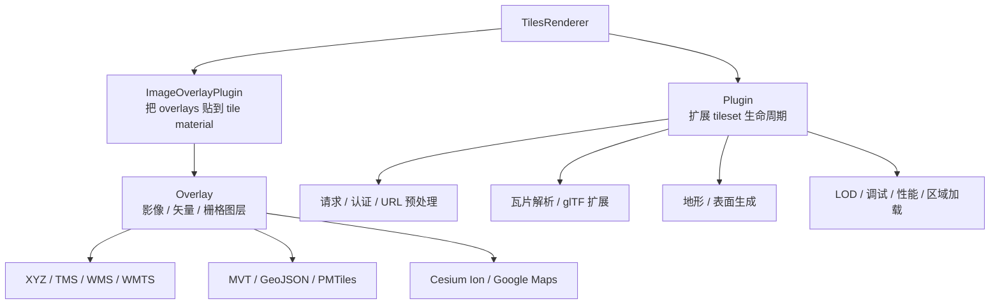
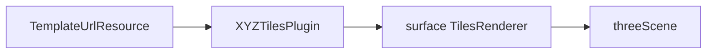
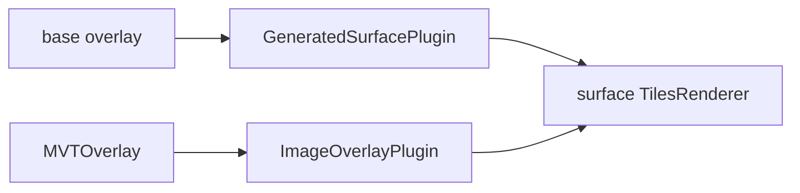
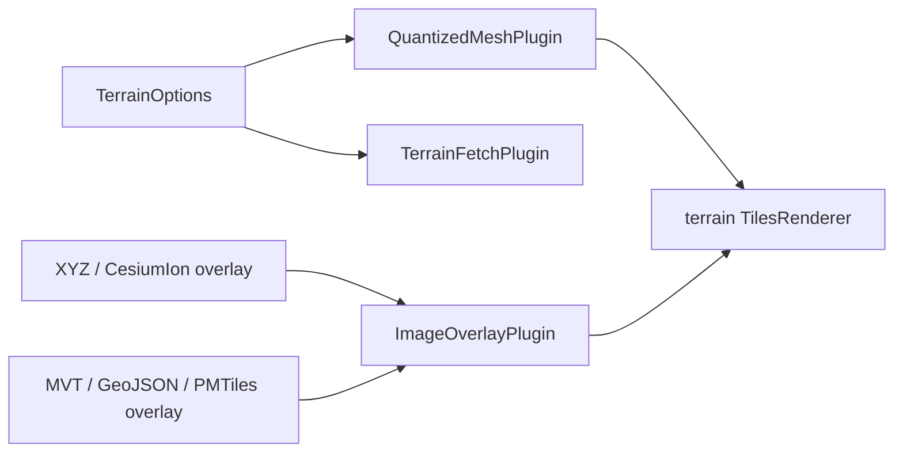
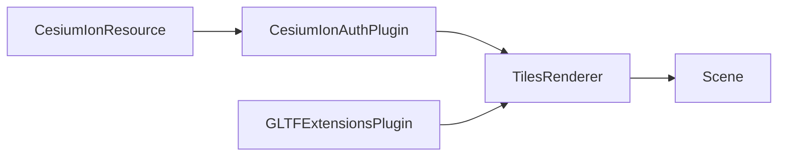

# 3d-tiles-renderer Plugins 与 Overlays

本文档说明 `3d-tiles-renderer` 中 plugin 和 overlay 的职责边界、常见能力，以及 Tellux 当前如何使用它们。这里的重点不是逐项复刻上游 API，而是帮助 Tellux 后续设计资源类型、图层能力和调试能力时判断应该接入哪一类扩展。

## 总体区别

`Plugin` 是挂在 `TilesRenderer` 上的扩展对象，用于影响 tileset 生命周期、数据请求、瓦片解析、模型处理、LOD 过渡、地形生成、表面生成、调试显示、内存管理等核心行为。

`Overlay` 是被 `ImageOverlayPlugin` 消费的图层对象，用于把影像、矢量数据或栅格化结果贴到已有 3D tile 几何、地形表面或生成表面上。

简单理解：

- `Plugin` 管的是 tileset 怎么加载、怎么解析、怎么生成、怎么显示。
- `Overlay` 管的是额外图层怎么取数据、怎么生成纹理、怎么贴到表面上。
- `ImageOverlayPlugin` 是 plugin 和 overlay 的连接器：它把一个或多个 overlay 复合到 tile material 上。



## Plugin 的职责

`TilesRenderer` 在加载、遍历、下载、解析、模型处理、可见性变化和销毁等阶段会调用已注册插件。插件可以只实现其中一部分 hook，因此上游插件通常按能力拆得比较细。

常见职责包括：

- 请求前处理：改写 URL、继承 query、添加 token、接管 fetch。
- 根 tileset 加载：从外部平台 asset endpoint 获取真正的 tileset URL。
- 瓦片解析：把自定义格式或地形数据转换成 Three.js 可渲染对象。
- 模型处理：在 glTF 加载后注册扩展、修改 geometry、material 或 metadata。
- 可见性处理：在 tile active / visible 变化时做 fade、卸载、调试显示等。
- 渲染调度：根据相机、区域、误差或变化事件影响 update 行为。
- 资源释放：控制 CPU/GPU 缓存和 tile dispose 行为。

## Overlay 的职责

Overlay 不直接管理 `TilesRenderer` 的核心生命周期。它主要向 `ImageOverlayPlugin` 提供图层纹理，告诉插件某个 tile 对应区域应该显示什么 overlay texture。

Overlay 常见职责包括：

- 根据 tile 范围计算请求 URL。
- 请求影像瓦片、矢量瓦片或外部平台影像。
- 把 GeoJSON / MVT / PMTiles 等矢量数据栅格化成 texture。
- 提供 opacity、color、alpha mask、绘制顺序等图层样式。
- 管理 texture lock / cache / failed overlay retry 等状态。

Overlay 的优势是可以被复用到不同表面：同一个 overlay 可以贴到真实 3D Tiles、quantized-mesh 地形，也可以贴到 `GeneratedSurfacePlugin` 生成的椭球表面。

## 主要 Plugin 分类

### 认证和平台接入

#### CesiumIonAuthPlugin

用于从 Cesium Ion asset id 解析 endpoint，并为后续请求带上 Ion token。适合 3D Tiles、影像或地形等 Ion asset 的入口处理。

Tellux 当前用法：

- `CesiumIonResource.fromAssetId(...)` 生成资源配置。
- 无 overlay 模式下，`TilesetManager` 注册 `CesiumIonAuthPlugin`。
- overlay 模式下，影像使用 `CesiumIonOverlay`。

能力重点：

- 解析 Cesium Ion asset endpoint。
- 添加授权信息。
- 支持自动刷新 endpoint 授权。
- 可收集 attribution。

#### GoogleCloudAuthPlugin

用于 Google 相关 tile 服务的认证。Tellux 当前没有接入。后续如果支持 Google Photorealistic Tiles 或 Google Maps overlay，需要单独考虑 API key、服务条款和 attribution 展示。

### glTF 和模型处理

#### GLTFExtensionsPlugin

用于给 tile 内容中的 `GLTFLoader` 注册 3D Tiles 相关 glTF 扩展和常见压缩扩展。

Tellux 当前默认注册：

- 传入 `DRACOLoader`。
- `autoDispose: false`，Draco loader 生命周期由 Viewer 管理。

能力重点：

- 支持 `CESIUM_RTC`。
- 支持 `EXT_structural_metadata`。
- 支持 `EXT_mesh_features`。
- 支持 Draco、KTX2、Meshopt 等扩展能力。

后续价值：

- feature picking。
- 结构化 metadata 查询。
- 点击建筑或构件后读取属性。

#### TileCreasedNormalsPlugin

这是 Tellux 本地插件，不是上游内置插件。它在 tile model 加载后重新生成折痕法线，用于改善部分模型的光照边缘。

注意点：

- 会遍历 mesh 并重建 geometry。
- CPU 和内存成本较高。
- 当前 Tellux 通过 `scene.creasedNormals` 控制，默认关闭。

### 地形和表面生成

#### QuantizedMeshPlugin

用于把 Cesium quantized-mesh terrain 转成 3D Tiles 可调度和渲染的内容。

Tellux 当前用法：

- `terrain.url` 指向 terrain 根目录或 `layer.json`。
- `TilesetManager.createTerrainTileset()` 创建 `TilesRenderer`。
- 注册 `QuantizedMeshPlugin`。
- 再注册 `TerrainFetchPlugin` 做 gzip 和 query 继承兜底。

能力重点：

- 从 `layer.json` 读取地形描述。
- 动态生成 terrain tile content。
- 支持 skirt。
- 支持生成法线。
- 支持 solid closed mesh。
- 支持推荐加载设置。

#### GeneratedSurfacePlugin

用于根据 tiling scheme 生成瓦片化表面。它常和 overlay 搭配，用于没有真实地形或 3D Tiles 几何时生成一个可贴图的椭球或平面表面。

Tellux 当前用法：

- 在有 overlay 的无地形 surface 模式下注册。
- `shape: 'ellipsoid'`。
- `applyOverlayTexture: false`，真正 overlay 贴图由 `ImageOverlayPlugin` 负责。

能力重点：

- 可根据 overlay 的 tiling scheme 派生表面瓦片。
- 可生成椭球或平面表面。
- 可以配合 `ImageOverlayPlugin` 显示底图和业务叠加层。

### 影像表面插件

这类插件直接生成一个影像瓦片表面，适合“把地图瓦片作为主表面”的场景。

常见插件：

- `XYZTilesPlugin`
- `TMSTilesPlugin`
- `WMSTilesPlugin`
- `WMTSTilesPlugin`
- `DeepZoomImagePlugin`

Tellux 当前用法：

- template-url 无 overlay 模式下注册 `XYZTilesPlugin`。
- 固定 `shape: 'ellipsoid'`，生成基础地球表面。

与 overlay 的区别：

- `XYZTilesPlugin` 这一类直接负责生成可渲染 surface tiles。
- `XYZTilesOverlay` 这一类只提供贴到已有 surface/terrain/3D tile 上的纹理。

### ImageOverlayPlugin

`ImageOverlayPlugin` 是 overlay 体系的核心 plugin。它负责把一个或多个 overlay 复合到 tile geometry 的 material 上。

能力重点：

- 支持多个 overlay。
- 支持 overlay 顺序控制。
- 支持 overlay 增删和重排。
- 支持失败 overlay 重试。
- 支持 tile splitting，让 overlay 和瓦片边界更贴合。
- 会处理 tile scene 和 material，使 overlay texture 能叠加到几何表面。

Tellux 当前用法：

- 地形模式下，底图和 MVT 都通过 `ImageOverlayPlugin` 贴到 terrain。
- 无地形且存在 overlays 时，`GeneratedSurfacePlugin` 生成椭球表面，`ImageOverlayPlugin` 负责真正贴 overlay。
- `MVTOverlay` 没拿到 texture 时，Tellux 会返回透明 fallback texture，避免 overlay 纹理为空导致渲染链路不稳定。

### LOD 和按需更新

#### TilesFadePlugin

用于 LOD 切换时淡入淡出，减少瓦片 pop-in。

Tellux 当前默认注册。

能力重点：

- tile 显隐变化时做 fade。
- 可降低快速切换层级时的突兀感。
- 会影响 tile visible / active 状态的表现。

#### UpdateOnChangePlugin

用于按需更新。当相机、瓦片、fade 或显式更新需求没有变化时，可以减少不必要的 tileset update。

Tellux 当前默认注册。

能力重点：

- 降低无变化时的 update 成本。
- 适合事件驱动或相机静止后的场景。

### 调试插件

#### DebugTilesPlugin

用于显示 tileset 调试信息。Tellux 当前未接入。

能力重点：

- 显示 bounding volume。
- 按 depth、error、distance、load order 等模式着色。
- 支持 parent bounds。
- 支持 unlit 调试显示。

适合 Tellux 后续提供开发期 debug 开关，例如：

```ts
viewer.debug.showBoundingVolume = true
viewer.debug.colorMode = 'geometricError'
```

### 性能和内存插件

#### UnloadTilesPlugin

用于不可见瓦片的 GPU 资源释放。Tellux 当前未接入。

能力重点：

- tile 不可见后释放 GPU geometry / texture / material。
- CPU 侧缓存仍可保留，避免重复下载。
- 可提供 GPU 估算字节数。

适合移动端、大范围城市级 tileset 或长时间运行场景。

#### TileCompressionPlugin

用于压缩 geometry attribute、减少显存和内存占用。Tellux 当前未接入。

注意点：

- 可能牺牲部分视觉质量。
- 可能和需要原始 geometry attribute 的插件或业务冲突。

#### BatchedTilesPlugin

用于把大量 tile mesh 合批到 Three.js `BatchedMesh`，降低 draw calls。Tellux 当前未接入。

注意点：

- 适合大量相似材质或大量 mesh 场景。
- 与修改 material、依赖单独 mesh metadata、需要精细 picking 的能力可能存在兼容风险。

### 区域加载和几何处理

#### LoadRegionPlugin

用于限制加载区域。Tellux 当前未接入。

能力重点：

- 支持 sphere、ray、OBB 等区域。
- 可做 mask，阻止区域外瓦片加载。
- 适合局部工程场景、重点区域浏览或分析查询。

#### TileFlatteningPlugin

用于把 tile 顶点压到指定 shape 表面，可用于局部平整、道路、平台等工程处理。Tellux 当前未接入。

注意点：

- 会改变几何数据。
- 接入前需要独立验证精度、性能和视觉副作用。

#### ReorientationPlugin

用于重定向 tileset 坐标或按经纬高放置 tileset。Tellux 当前未接入。

能力重点：

- 自动重定向。
- 重置或调整 tileset 原点。
- 可用于局部模型和地球坐标系统对齐。

## 主要 Overlay 分类

### Tiled image overlays

这类 overlay 以瓦片影像为输入，把对应区域的影像贴到 3D 几何上。

常见 overlay：

- `XYZTilesOverlay`
- `TMSTilesOverlay`
- `WMSTilesOverlay`
- `WMTSTilesOverlay`
- `DeepZoomOverlay`

能力重点：

- 根据 tile range 计算影像 URL。
- 支持 opacity。
- 支持投影和瓦片方案。
- 可贴到 terrain、3D Tiles 或 generated surface。

Tellux 当前已使用：

- `XYZTilesOverlay`：template-url 在 overlay 模式下使用。

### 平台影像 overlays

#### CesiumIonOverlay

用于把 Cesium Ion imagery asset 作为 overlay。它只适合 Ion imagery 类型，不等同于加载 3D Tiles asset。

Tellux 当前已使用：

- `cesium-ion` resource 在 overlay 模式下创建 `CesiumIonOverlay`。

#### GoogleMapsOverlay

用于 Google Maps 2D tile imagery。Tellux 当前未接入。接入时需要额外考虑 token、服务条款和 attribution。

### 矢量 overlays

#### GeoJSONOverlay

用于把 GeoJSON 数据栅格化到 tile texture，再贴到几何表面。Tellux 当前未接入。

适合能力：

- 行政边界。
- 线、面、点业务数据。
- 小到中等规模的静态矢量图层。

后续接入建议：

- 新增 `GeoJsonResource`。
- 设计 style callback。
- 明确大数据量时的性能边界。

#### MVTOverlay

用于加载 Mapbox Vector Tile，并把矢量瓦片绘制成 texture 后贴到几何表面。

Tellux 当前已使用：

- `MVTResource.fromUrl(...)` 创建资源配置。
- `TilesetManager.createMVTOverlay()` 创建 overlay。
- 支持 `getStyle(layerName, properties)` 样式回调。

能力重点：

- 按 MVT 图层和 feature 属性绘制。
- 支持 fill、stroke、strokeWidth、radius、order、visible 等样式。
- 适合道路、电力、水系、业务线面等瓦片化矢量图层。

注意点：

- 依赖 `@mapbox/vector-tile` 和 `pbf`。
- 高分辨率和复杂样式会增加 canvas 栅格化成本。
- Tellux 当前对空 texture 做了透明 fallback。

#### PMTilesOverlay

用于 PMTiles 数据源。Tellux 当前未接入。

适合能力：

- 单文件瓦片归档。
- 离线或内网部署。
- 矢量或栅格瓦片统一分发。

后续接入建议：

- 新增 `PMTilesResource`。
- 明确 optional peer dependency。
- 和 MVT 样式回调尽量复用。

## Plugin 与 Overlay 的组合方式

### 无地形基础影像



用途：只有基础影像，无业务 overlay，无 terrain。Tellux 当前通过 `XYZTilesPlugin({ shape: 'ellipsoid' })` 生成椭球地球表面。

### 无地形但有业务叠加层



用途：没有 terrain，但需要把 MVT 或后续 GeoJSON、WMS 等叠加到椭球表面。`GeneratedSurfacePlugin` 提供可贴图表面，`ImageOverlayPlugin` 把 overlays 贴上去。

### 地形加影像叠加



用途：显示 quantized-mesh terrain，并把底图和业务图层贴到地形表面。

### Cesium Ion 3D Tiles



用途：加载 Ion 上的 3D Tiles asset。`CesiumIonAuthPlugin` 处理 endpoint 和认证，`GLTFExtensionsPlugin` 处理 glTF 扩展。

## Tellux 当前接入清单

当前已接入：

- `GLTFExtensionsPlugin`
- `TilesFadePlugin`
- `UpdateOnChangePlugin`
- `XYZTilesPlugin`
- `ImageOverlayPlugin`
- `XYZTilesOverlay`
- `CesiumIonAuthPlugin`
- `CesiumIonOverlay`
- `GeneratedSurfacePlugin`
- `MVTOverlay`
- `QuantizedMeshPlugin`
- `TerrainFetchPlugin`
- `TileCreasedNormalsPlugin`

当前未接入但适合后续评估：

- WMS / WMTS / TMS plugin 和 overlay。
- `GeoJSONOverlay`。
- `PMTilesOverlay`。
- `DebugTilesPlugin`。
- `UnloadTilesPlugin`。
- `LoadRegionPlugin`。
- `ReorientationPlugin`。
- `TileCompressionPlugin`。
- `BatchedTilesPlugin`。
- `TileFlatteningPlugin`。

## 对 Tellux API 设计的建议

1. 面向用户继续使用 resource helper。
   - `TemplateUrlResource`
   - `CesiumIonResource`
   - `MVTResource`
   - 后续 `WMSResource`、`GeoJsonResource`、`PMTilesResource`

2. 不直接暴露上游 plugin 类作为首选 API。
   - 上游插件很强，但配置细节偏底层。
   - Tellux 应优先包装成 GIS 用户熟悉的 provider / layer / overlay API。

3. 把 overlay 能力设计成图层。
   - 后续可以引入 `viewer.layers.add(...)` 或 `viewer.setImageryOverlays(...)` 的增强版本。
   - 每个 overlay 应包含资源、样式、透明度、顺序、可见性。

4. 性能敏感插件先做可选项。
   - `TileCreasedNormalsPlugin` 当前已默认关闭。
   - `UnloadTilesPlugin`、`TileCompressionPlugin`、`BatchedTilesPlugin` 接入前应先做示例和压测。

5. 调试能力可以单独形成 debug API。
   - `DebugTilesPlugin` 不适合作为普通业务配置。
   - 可以设计为开发期开关，而不是默认渲染能力。

## 注意事项

- Plugin 和 overlay 的命名很像，但职责不同。`XYZTilesPlugin` 是生成表面的 plugin；`XYZTilesOverlay` 是贴到表面的 overlay。
- `ImageOverlayPlugin` 是 overlay 体系的入口，没有它，overlay 不会作用到 tile material。
- `GeneratedSurfacePlugin` 经常和 overlay 搭配，但它本身是 plugin，不是 overlay。
- 部分插件会修改 geometry 或 material，接入前要评估和 picking、metadata、后处理的兼容性。
- 部分 overlay 依赖额外包，例如 MVT 依赖 `@mapbox/vector-tile` 和 `pbf`，PMTiles 也可能需要额外依赖。
