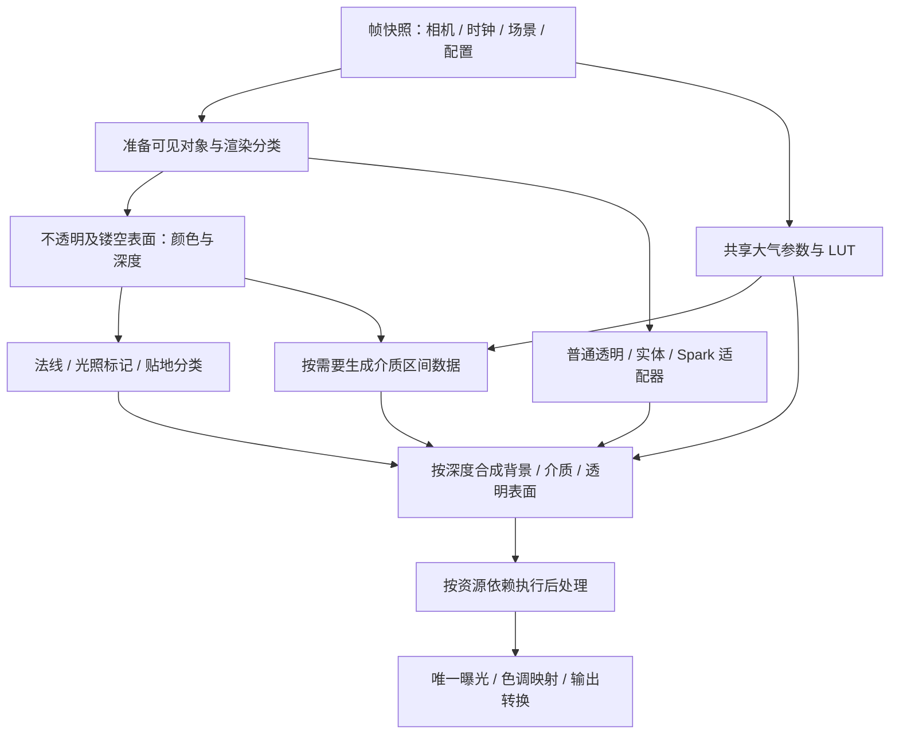

# 统一场景渲染与大气、透明合成架构

> 状态：**方案草案，待维护者审查；尚未采纳，也未启动引擎重构。**
>
> 日期：2026-09-06。范围：Tellux 场景绘制、大气、透明表面、高斯、体积云与最终输出的内部架构。
>
> 修订：2026-09-06 根据设计审查补齐重叠介质积分、折射路径和低分辨率深度有效域；这些规则仍待 A 阶段实验验证。
>
> 用户已批准三个 Sandcastle 最小原型及本文编写；不等于批准本方案全部技术选择、上游 fork、后端迁移或公开 API 变更。

> 实施进展：用户随后批准从 A1 开始边界验证。[首轮联合介质实验](../research/A1联合介质积分验证.md)已运行，解析 GPU 对照通过，但真实介质质量、完整大气源项与性能尚未通过闸门；尚未进入正式引擎重构。

## 1. 要解决的问题与目标

当前透明实体和 Spark 高斯先后出现“跨地平线部分被天空覆盖”。原因是颜色已经包含透明对象，深度仍只表示背景，大气据此把像素判为天空并替换颜色。逐个对象向后移动能消除覆盖，但没有建立透明内容的空气透视、云遮挡或跨渲染器排序规则。

目标是让 Tellux 拥有可维护的场景合成架构：

1. 渲染入口、资源依赖、颜色含义和生命周期由唯一管线协调。
2. 不透明、透明和天空使用一致的大气模型，透明对象按自身位置参与空气透视。
3. 云和透明表面按空间关系合成，不能把“所有透明内容盖在云上”作为最终行为。
4. 普通网格、实体 OIT、Spark 与透射材质有明确适配和质量边界。
5. 开关、resize、相机切换、销毁、上下文恢复与依赖升级均有可验证契约。
6. WebGL/WebGPU 共享领域语义与验收目标，后端实现和可用能力可以不同，不能虚报对等。

“工业级”的验收含义是行为一致、误差受控、失败可诊断、性能可测、升级可维护，不是承诺任意透明层数与体积交叉都数学精确。

本次不更换 GIS 数据调度、坐标公开面或 Viewer 领域门面；不把 Spark 纳入核心包静态依赖；不把正式发布绑定到所谓 npm 1.0。公开 API 如确需新增，另给出初始化/运行时同构设计供审查。

## 2. 已有证据与未证明的部分

### 2.1 当前依赖与实现

本轮核对安装版本：Three.js 0.184.0、Atmosphere 0.19.1、Clouds 0.7.6、postprocessing 6.39.1、Spark 2.1.0、高斯 Tiles 插件 0.1.14。锁定版本升级后必须重新核查。

| 当前实现 | 事实与约束 |
| --- | --- |
| `WebGLRenderer` / `WebGLOutput` | 主场景内先绘制 opaque、transmissive、transparent，再执行 effects；不能靠 effects 数组顺序把大气插入已完成的主场景绘制中 |
| `PostProcessingManager` | 实体 OIT 已在大气之后；Spark 仍随 raw scene 绘制，旧实体修复没有覆盖它 |
| `WebGPUPostProcessingManager` | 已有唯一 scenePass、RenderPipeline 和 delegate；应演进其职责，不能再增加第二个竞争的组合根 |
| Takram 大气 | 导出了 Bruneton shader 和 LUT 能力；可以按空间点求透射率与散射，不等于已有通用透明材质集成 |
| Takram 云 | 对外主要提供 overlay、shadow、shadowLength；内部虽有 depthVelocity，但其 frontDepth 是积分加权的代表距离，不是完整介质分布 |
| Spark | 支持自定义 shader、uniforms 和目标；绑定 WebGLRenderer，不提供跨普通透明/OIT 的全局排序 |

云 shader 的 `weightedDistanceSum / transmittanceSum` 生成代表深度，随后输出 `depthVelocity`。不能据此推导“只要公开这个深度，就能准确把任意透明表面插入云内”。

### 2.2 三个原型

使用与观测详见 [实验说明](../../docs/guide/rendering-prototypes.md)，源码为 [分阶段](../../examples/rendering-stages.ts)、[高斯](../../examples/rendering-splat-atmosphere.ts)、[云穿插](../../examples/rendering-cloud-transparency.ts)。

| 原型观测 | 可以支持的结论 | 不能支持的结论 |
| --- | --- | --- |
| 青色柱跨地平线完整显示，白墙遮挡正确 | 独立透明目标加不透明深度采样可接入当前 effects 链 | 所有材质、阴影、MRT、XR 和相机组合均正确 |
| Spark Butterfly 显示，散射开关产生像素差异 | Takram GLSL/LUT 可以接入 Spark，深度与大气路径实际执行 | 高斯体积积分物理正确、远近误差已量化、夜间/全部外观参数一致 |
| 云遮挡不透明柱，后合成透明柱覆盖云 | 单纯前后换序不能满足云穿插目标 | 已证明唯一算法、已经完成混合透明排序 |

原型采用私有字段访问、setEffects 拦截、固定 layer 30 和案例 shader 注入。这些是取证接缝，不迁入正式公共实现。高斯用当前栅格深度近似，不应表述为真实体积表面深度。

## 3. 拟定架构与资源图

拟采用**唯一场景管线协调器 + 后端执行器 + 显式资源依赖**。先建设满足当前需求的有限渲染图，不自行重写 Three.js 的 GPU 驱动、完整材质系统或通用调度框架。

无云且采用排序透明路径时，可以实现为“不透明 → 不透明空气透视及天空 → 已计算自身大气的透明表面 → 后处理 → 输出”。

有云和多层穿插时，`Compose` 必须展开为空间区间合成，不能仍只是一张云背景再叠透明颜色。两条路径共享数据语义，不把高质量路径建立在重复雾化后的背景上。

### 3.1 所有权

名称为内部职责建议，不是已决定的类名或公共 API。

| 所有者 | 责任 | 不允许承担的责任 |
| --- | --- | --- |
| Viewer / 帧循环 | 更新时钟、相机、业务数据；提交一次帧渲染 | 每个效果自行增加 RAF 或接管 delegate |
| 场景管线协调器 | 组织阶段、汇总资源需求、配置能力和最终输出 | 解析高斯数据或实现云密度模型 |
| 后端执行器 | WebGL framebuffer/pass 或 WebGPU 节点/执行，状态恢复 | 向业务代码暴露隐含 targetA/B 的位置规则 |
| 帧资源管理 | 尺寸、格式、采样数、清除/保留、分配/复用/销毁 | 释放借用的几何、材质或外部纹理 |
| 大气模块 | 参数、LUT、坐标变换、天空及介质求值接口 | 持有第二条主场景管线 |
| 云模块 | 云密度、消光和照明源项，以及云专用历史资源 | 只返回最终图后宣称支持任意深度查询 |
| 介质积分阶段 | 在重叠区域统一积分大气与云，持有区间结果；可在云扩展模块内实现 | 串接同一区间内两份已完成的介质合成，或再次应用整段空气透视 |
| 渲染适配器 | 对象分类、shader 接入、透明数据输出、能力声明 | 绕过统一曝光或私自清空场景深度 |

WebGPU 已接受的 [单一后处理图 ADR](0003-webgpu-post-processing-graph.md) 继续有效。本方案拟扩展其场景合成职责，不撤销单一所有者、统一附件和唯一输出原则。

### 3.2 资源契约

| 逻辑资源 | 含义与要求 |
| --- | --- |
| opaqueColor | 场景线性 HDR 表面颜色；标明是否完成照明、是否已应用介质 |
| opaqueDepth | 最近不透明/镂空表面的深度；定义编码、清空值、projection、采样/resolve 方式 |
| normal / lightingMask | 按消费者需要分配；保留局部与地球光照语义 |
| backgroundColor | 指定合成阶段的背景；透射采样必须声明版本，不能边读边覆盖 |
| refractionBackground | 独立于当前写入目标的背景快照；声明颜色空间、已含介质范围、相机、深度、mip 和有效屏幕区域。屏幕空间近似与沿折射路径求值不能共用未标记的含义 |
| transparentColor / coverage | 明确预乘 alpha 与混合规则；alpha 覆盖率不等于 RGB 介质透射率 |
| mediumSegments | 大气与云联合积分后的各区间 RGB 透射率及散射；不含表面颜色和相机到区间起点之前的介质。绑定相机、区间、物理长度、有效深度范围和时间戳 |
| mediumValidity | 区间实际覆盖范围、边界和历史有效性；未计算区域不等于真空。低分辨率生成与全分辨率查询遵循第 5.7 节 |
| velocity / history | 标明来源、有效性与拒绝规则；高斯没有速度时不能伪造为稳定历史 |
| finalColor | 唯一输出变换的输入，禁止混入已经输出到 sRGB 的像素 |

阶段声明读写资源、允许原位合成与否、清除/加载语义、尺寸、历史失效条件。依赖图应检测循环、未初始化读取、不支持格式及反馈读写。先不实现跨帧瞬态别名等复杂优化。

深度纹理“可以采样”不等于当前 framebuffer 的硬件深度测试使用它。后端显式选择兼容深度附件、合法复制/resolve 或 shader 比较；不得在相同 draw 中采样仍被作为冲突附件写入的资源。需验证 MSAA、DPR、resize、near/far 更新。

## 4. 共享大气与颜色规则

### 4.1 求值含义

大气模块提供相机到位置以及空间区间的透射率 `T` 与散射辐亮度 `S`。在相同辐射单位下，表面颜色的空气透视为：

`C_view = T × C_surface + S`

对普通 alpha 覆盖表面，可在明确的近似模型内先对表面求值，再按 coverage 混合已正确处理的背景。不能对已含背景的整张透明结果再统一加同一份散射；不能把 RGB 消光当作单通道 opacity。

实现应统一 ECEF/相机相对坐标、米与 LUT 长度单位、椭球高度修正、昼夜光源方向。优先在 CPU 使用双精度建立相机相对变换，避免 GPU 上两个地心大数相减。大气单元测试与 GPU 参考像素共同校验坐标/矩阵约定。

### 4.2 三类颜色不能混为一谈

1. 已照明的线性表面辐亮度：不再由后处理重复照明。
2. 地表 albedo：按现有 `post-process` 光照策略处理，迁移时保留模式语义。
3. 点云/部分高斯的显示参考颜色：保留 [点云显示色 ADR](0002-display-referred-point-cloud-colors.md) 和现有案例策略，不因“全部统一到物理模型”而静默改变。

显示参考颜色与物理空气透视存在产品语义选择：保留源色模式和参与环境模式需要明确区分，不能宣称两者同时严格成立。先保持现有行为；新增模式在 API 审查时决定，不默认删除源色补偿。

全流程 HDR、预乘 alpha、曝光与输出转换各有唯一责任点。Bloom 应消费合适的 HDR 结果；SMAA、TAA、景深、EDL、标注和描边按实际资源与既有行为排序，不能统一归为“最后随便执行”。

## 5. 透明与云的拟选技术路线

### 5.1 渲染分类

分类粒度至少覆盖 material group，不按整棵 Object3D 的 `transparent` 标志二选一。

| 类型 | 初步路线与边界 |
| --- | --- |
| 不透明 / alphaTest 镂空 | 主场景深度与表面阶段，保持阴影和裁剪语义 |
| 普通 alpha 透明 | 原生排序路径作为基础；介质合成时输出区间内表面贡献 |
| 实体 weighted OIT | 保留独立适配器；显式声明近似，不能假定与 Spark 的混合自动有序 |
| Spark 高斯 | 保留数据/排序所有权，适配绘制目标、深度、大气和分区；禁止改写解码坐标以修合成 |
| transmission 玻璃/水 | 独立背景采样与折射路径契约；A 阶段比较原生屏幕空间近似和路径介质求值，不能仅用当前像素的视线区间承诺正确性，见第 5.6 节 |
| 体积云 | 介质积分，不归入普通透明表面队列 |
| 标注 / UI | 保留独立遮挡与显示策略，不强行套物理空气透视 |

### 5.2 拟选：按深度区间合成介质与透明内容

这是**待验证的工程路线**，不是现成上游功能或已经确认的最终算法。

沿视线划分有界深度区间，介质积分阶段输出每个区间的联合 `T_i`、`S_i`；透明适配器把片元分配到对应区间。全分辨率合成查询以本像素最近不透明表面为终点；这不等于低分辨率介质生成可直接按一个代表表面深度截断，生成规则见第 5.7 节。合成时按空间顺序处理介质与表面，避免近处透明表面被远处云遮挡，也避免远处透明表面无条件盖住近云。

第一轮评估 8/16/32 个区间、不同分辨率与相机深度分布；不是把 32 作为产品默认。半开区间必须保证每个透明片元仅贡献一次，边界移动时需要稳定策略，防止闪烁或重复累积。

该方案仍有两种误差，必须显式验收：

- 同区间内多透明层的顺序近似。可比较区间内 weighted OIT 与排序合成；不能把 Spark 已混合的整图再加入 OIT 并称为精确排序。
- 介质和表面在同区间内的相对位置近似。需比较增加切片、自适应分区或局部重新积分，不以一个加权代表深度代替所有层。

WebGL 原型可先逐区间渲染，证明数据与合成含义；生产性能不能假定这条多遍路径可接受。Spark 是否能复用排序、按区间选择有效 splat、避免全量重复 draw，是独立性能闸门。

### 5.3 避免重复散射与数值不稳定

对于同一射线上前后相邻、互不重叠的区间，满足组合关系：`T_ac = T_ab × T_bc`，`S_ac = S_ab + T_ab × S_bc`。该公式不能直接把同一空间区间内的大气和云当作前后两层串接。

高质量路径拟由一个介质积分阶段负责最终 `mediumSegments`。大气模块和云模块提供兼容单位的消光系数及照明散射源项；同一点的消光相加，源项在明确的照明近似下相加，然后用联合消光沿视线积分。记 `sigma_t = sigma_air + sigma_cloud`，`j = j_air + j_cloud`，则区间透射率为 `exp(-∫sigma_t ds)`，区间散射为 `∫T(a,s) j(s) ds`。`j` 是单位路径长度的辐亮度源项，不是已有的区间积分颜色。

这一定义规定视线积分，不代表大气与云的多次散射照明已精确耦合。太阳/天空光、云影、各自多次散射近似及贡献排除需单独列入照明契约。Takram 现有 LUT 或云 shader 是否能提供所需局部源项，必须在 A 阶段核查并实验；若只能取得已积分颜色，不能强行充当 `j`，需改求值接口或重新审查算法路线。

适配时应旁路高质量路径里云成图的 `applyAerialPerspective` 和后续整段重复雾化，保留上游原路径作对照。纯大气 LUT 快速路径可保留；云为零时联合积分应在规定误差内与其一致。联合积分产物已经包含本区间的大气与云，表面/合成阶段不得再叠加同一区间的另一份 `T/S`。

A 阶段先使用人为设定的均匀消光与恒定源项验证积分器：区间长度 `L` 时，逐 RGB 通道的解析解为 `T = exp(-sigma_t L)`、`S = j × (1-T) / sigma_t`；`sigma_t` 为零时取极限 `S = jL`。覆盖仅大气、仅云、重叠、前后相邻区间、零消光和稠密介质。该测试证明积分规则，不代替真实大气/云照明质量测试。

优先输出/保存区间积分，或提供稳定的区间求值。不能在稠密云中无条件用累计 `T_b / T_a`、`(S_b-S_a)/T_a` 还原区间；`T_a` 接近零会导致数值爆炸，应提前终止或使用有定义的稳定策略。

高质量路径中的表面贡献和介质贡献只应用一次。不能先把背景完整雾化，再对整个背景重复穿过所有区间。纯大气基线路径和分区路径须在“无云、无透明”条件下收敛到相同输出。

### 5.4 云上游改动边界

拟保留 Takram 的天气、密度和可复用光照模型，扩展源项求值、联合积分输出及历史处理；不能预设只加几个输出附件就足够，也不直接复制整个上游仓库。

- 新增联合介质区间结果及有效范围，按第 5.7 节区分生成时的覆盖域与查询时的表面终点。
- 现有最终 overlay 和代表深度只能作为对照或降级路径，不能作为任意区间查询接口。
- 云历史需按相机、区间布局和遮挡变化失效；不能把当前整图 resolve 直接复用于所有切片。
- 大气/云重复散射、云影及 shadowLength 需分别追踪，第一轮原型先隔离这些贡献，再逐项恢复。
- 优先形成小范围上游扩展提案；若发布接口不可扩展，评估固定版本 patch 或维护明确边界的 vendor 模块，并记录许可证、来源与升级测试。本文不预先授权整体 fork。

### 5.5 参考实现与不选的捷径

少量几何、低分辨率场景用 depth peeling / 有限透明层捕获加高采样介质积分作为参考。参考也必须声明层数上限并检测溢出，不能以另一种未知近似当真值。真实高斯需要单独参考和误差评估，不能仅靠网格参考证明全部高斯正确。

暂不把 WebGPU A-buffer/PPLL 列为默认生产方案：内存上限、溢出与排序成本、WebGL 不具备同等执行路径均待评估。可作为后续候选，不是“升级 WebGPU 即自动解决”。

明确不采纳：永久关闭透明雾化、所有透明内容永远在云后合成、给全部高斯开启深度写入、依赖一个云代表深度解决多层穿插、用全局 renderOrder 修跨 pass 顺序。

### 5.6 折射路径与支持边界

Three.js transmission 根据折射方向和厚度采样偏移后的屏幕坐标；该坐标的已雾化背景属于另一条相机射线。因此，读取“已有天空/大气的背景”并不能证明介质沿真实折射路径正确，也不能简单减去当前像素的相机到玻璃积分。

A 阶段必须比较以下两种契约，记录质量与成本后再决定支持档位：

| 路径 | 明确含义 | 需要验证的边界 |
| --- | --- | --- |
| 原生屏幕空间折射近似 | 使用不可变 `refractionBackground` 快照，保留其已含介质含义；不对整份样本再次执行相机到玻璃的完整空气透视 | 有厚度、粗糙度、相机运动、视线偏移、屏幕外与遮挡数据缺失；只能称为屏幕空间近似，不能通过本路径宣称云内折射物理正确 |
| 沿折射路径求值 | 区分相机到入射点、物体内部吸收、出射点到背景的路径；在可用几何/体积数据上求实际路径的介质贡献 | 原相机视线切片通常不够，需世界空间介质查询或专门射线积分、有效背景交点；缺失/屏幕外路径必须返回能力或有效性状态 |

高质量路径不能从已雾化的屏幕颜色稳定反推出任意折射路径的背景辐亮度。若采用路径求值，需要提供对应背景的未应用外部介质的表面辐亮度，或明确来源的环境辐亮度，并定义内部吸收与外部介质的边界。

验证场景包含可调厚度和 IOR 的玻璃板、前后不同深度的云、近处遮挡物、离屏背景与粗糙折射；对比无介质参考、原生近似和路径参考。大气开关不得造成同一路径重复雾化。背景 mip 生成也必须绑定指定快照，不能读到当前 pass 的中间结果。

原生近似可以作为保留现有材质兼容性的候选，但不是未经审查的工业级质量降级。若其误差不满足验收而路径求值又无法实现，A 阶段不能宣告完整折射目标可行；必须重新审查支持范围或算法，不能等到 D 阶段才发现资源契约不足。

### 5.7 低分辨率介质的有效深度范围

基准实现先在声明的有限介质域内生成完整区间，不按某个低分辨率像素的最近不透明深度提前截断；全分辨率查询再根据本像素深度或透明片元位置终止。介质域的上限由场景范围、相机和质量配置明确给出，域外标记不可用，不能静默当作零散射。

这样可以先排除“低分辨率像素混有近墙与远天空，近墙截断后丢失天空方向介质”的数据缺失问题。边缘感知上采样只能降低插值误差，不能恢复没有生成的区间；介质横向欠采样仍需单独测量。

性能优化若需要按深度截断，只允许在 A 阶段与完整区间基准对照通过后启用：

- 深度先转换到统一的物理距离/区间坐标，不能直接对不同投影视线的原始 window depth 当作通用米制范围。
- 对每个生成单元，覆盖全部可能查询它的全分辨率像素及空间滤波足迹，采用保守的最远所需范围；足迹含天空时延伸至声明介质域上限，不能采用最近深度或均值。
- 记录每个单元/区间的实际有效范围。重投影导致覆盖域变化时拒绝无效历史；对移动物体新露出的背景重新生成数据，不能把旧的未生成区域作为真空插值。
- 最后一个不完整区间需要按查询距离求部分积分，或使用已经量化误差的重建模型；不能整段包含或整段丢弃。
- 保守裁剪规则只对已定义查询足迹成立。折射等偏移查询未被覆盖时，必须禁用该优化或另建覆盖域；不能复用主视线裁剪证明。

相应参考场景包括小于一个介质像素宽的细柱、墙边/远天空、地平线、相机横移导致显露、DPR 与分辨率变化。全分辨率结果分别与完整区间基准及高采样参考比较，轮廓不得因生成截断出现缺云或漏雾。

## 6. 上游支持与改动责任

| 上游 | 可保留复用 | Tellux 责任 / 验证门槛 |
| --- | --- | --- |
| Three.js WebGL | 渲染目标、材质、灯光、阴影、效果执行基础 | 构造真正分阶段提交；验证灯光/阴影不被重复生成、材质组不漏画、回调不重复；现有公开接口不足时再评估最小补丁 |
| Three.js WebGPU | 当前单一 RenderPipeline、节点、附件能力 | 演进现有图，独立实现后端阶段；不混用 GLSL EffectPass |
| Takram Atmosphere | LUT、空间点散射、天空及天体方向 | 稳定封装 shader/TSL 求值、参数与颜色语义；补证局部消光/照明源项接口；原型中的 PI 命名冲突要由适配边界解决 |
| Takram Clouds | 密度、光照、积分基础 | 源项与大气联合积分、区间有效域、重投影、云与透明合成；目前最大研发风险 |
| Spark | 加载、LOD、排序、shader 扩展 | 高斯场景适配与区间输出、深度/相机正确性；不假定现有 WebGL 实现可运行于 WebGPU |
| postprocessing | 可复用的 WebGL 效果算法 | 适配显式资源与输出契约，不能由其交换缓冲区位置定义业务深度 |

不因统一架构强制用户立刻切换 WebGPU。优先用当前 WebGL 高斯路径验证目标，同时让共享契约可以由 WebGPU 实现；WebGPU 云/高斯能力未实现时继续明确标为不支持。若完整质量目标只有 WebGPU 成本可接受，必须带测量结果重新审查后端产品范围。

## 7. 性能、质量与可观测性

### 7.1 先量化成本，不提前承诺帧率

举例：一个 1920×1080 RGBA16F 附件约 15.82 MiB，不含深度、MSAA、历史及对齐。若每区间保存两张 RGBA16F（16 字节/像素）：

- 960×540×32：约 253.13 MiB，仅区间数据。
- 480×270×32：约 63.28 MiB。
- 320×180×32：约 28.13 MiB。

因此不应默认全分辨率多切片。A 阶段需按第 5.7 节先验证完整区间覆盖，再测试低分辨率介质、边缘感知上采样、按需分配和保守区间跳过。透明表面保持全分辨率作为第一轮对照基准，低分辨率介质与其边缘匹配在进入 B 阶段前验收。压缩透射率数据前先证明误差可接受；以上估算还不含有效域、折射背景和路径查询可能新增的数据。

每次测量记录 GPU/驱动/浏览器、后端、物理分辨率/DPR、相机、数据规模、质量配置。GPU timer 不可用时明确缺失，不用 RAF FPS 冒充 GPU 耗时。分别报告 CPU 提交、各 pass GPU 时间、透明重复绘制次数、显存估计、历史资源与 p50/p95。

### 7.2 拟议验收门槛

以下数值是审查用初始门槛，不是当前测量结果；性能闸门在 A 阶段固定目标硬件后签定。

| 维度 | 必须满足的检查 |
| --- | --- |
| 基本正确性 | 地平线无整段消失；不透明遮挡正确；大气/云开关无透明内容残留或重复混合 |
| 退化一致性 | 无透明、无云路径与当前基准的差异有归因；颜色标定卡的输出转换只执行一次 |
| 重叠介质积分 | 均匀介质的解析测试覆盖零/高消光及相邻/重叠配置；与纯大气 LUT 的退化比较另列，不以积分器通过证明照明模型通过 |
| 折射路径 | 有厚度玻璃与云、遮挡及离屏场景在 A 阶段对照；近似误差、无效路径和拟支持档位必须明确后才能冻结背景/介质契约 |
| 低分辨率有效域 | 细柱、墙边、天空及显露场景相对完整区间基准无截断缺失；部分区间查询、空间滤波和历史重投影不读取无效数据 |
| 透明/云误差 | 与有限层参考比较；轮廓位移目标不超过 1 个物理像素；排除轮廓及随机采样后 RGB 绝对误差 p95 初始目标 ≤ 0.02（显示空间 [0,1]），同时检查 HDR 误差 |
| 时间稳定性 | 固定随机种子/时钟；相机跨切片、云边缘和 near/far 改变时无显著跳变；逐帧差分与人工观察共同判定 |
| 基础开销 | 关闭新增功能时，拟以相同硬件场景 CPU/GPU p95 不劣于基线 5% 为目标；先测噪声再定容差 |
| 高质量成本 | 列出各质量档的绝对毫秒和 MiB，目标硬件/帧预算未定前不声称达标 |
| 工程健康 | 无 shader 编译/GL 错误、读写反馈；多 Viewer、resize、销毁及上下文恢复测试通过 |

误差指标不能掩盖少量严重遮挡错误；即便平均误差低，穿山、整层消失或密云后物体浮到前面仍直接判失败。参考层数溢出、时间未收敛及不支持的材质必须单列。

调试输出至少提供各逻辑资源、深度区间、覆盖率/透射率、历史有效性、阶段执行次数与能力限制。导出的 JSON 不自动标记视觉通过。

## 8. 实施顺序与退出条件

云技术路线在大规模迁移前验证；不能先重构所有模块，再发现云数据契约不足。

| 阶段 | 工作与交付 | 进入下一阶段的条件 |
| --- | --- | --- |
| A：基准与关键算法补证 | 固定三个原型；补材质组、阴影/回调、透明交叉；完成下方 A1–A3；测目标硬件 | 联合积分、折射支持档位、低分辨率有效域三项均形成结论；确认误差、内存/重复 draw 成本及上游改动边界，才能冻结资源契约 |
| B：资源与阶段骨架 | 新建内部帧资源契约；单一协调器/后端适配；以无新增效果场景迁移并保持输出一致 | 深度与颜色所有权、resize/销毁/异常恢复通过；无额外整场景重复绘制 |
| C：共享大气与透明接入 | 普通透明、实体 OIT、Spark 适配；区分辐亮度/显示色；迁移现有案例，不公开原型接缝 | 地平线、遮挡、昼夜、远近与颜色回归通过；跨渲染器近似有实测边界 |
| D：云与复杂合成 | 生产化 A 阶段已验证的联合积分、区间有效域与历史处理、透明排序和折射路径；恢复云影等贡献 | 参考误差与目标质量档成本达标；不能在此阶段才首次决定背景/介质的核心契约 |
| E：后端与工程交付 | WebGPU 契约迁移和能力矩阵；后处理/标注回归；文档、skill、依赖补丁和构建预算检查 | 所有声明支持的组合通过；能力缺口显式列出，不自动扩大公开承诺 |

A 阶段拆成三个必须完成的审查项，执行先后可按数据依赖调整：

- **A1：联合介质求值**。均匀解析参考 → 上游局部源项可取得性 → 真实大气与云联合区间 → 纯大气退化与照明贡献审计。输出积分定义、GPU 对照与所需上游扩展。
- **A2：折射能力**。有厚度玻璃与云场景比较两条路径；输出背景快照、介质查询、离屏/无效路径契约，以及拟支持质量档和实测成本。不能只通过无折射透明面的测试。
- **A3：区间覆盖域**。完整区间基准 → 低分辨率生成/全分辨率查询 → 保守裁剪和历史有效性；输出细柱、墙边、地平线及显露对照，记录带宽/显存与误差。

A1–A3 的共同产物是可审查的数据契约和可复现证据，不是完成全部生产实现。任一项证明路线成本、误差或上游接口不可接受，暂停 B 阶段并比较替代方案、重新审查。不能以文档已补齐替代实验通过，不能静默退回“透明永久盖在云上”或未经认可的折射质量降级。

每阶段以可回退提交交付。实验 helper 仅用于对照；新旧路径可在迁移期内部并存，但不默认提供永久公共兼容层。保留已有工作区改动，不把其他任务文件纳入本次提交。

## 9. 预计触及的模块

- `src/Viewer.ts`、`src/rendering/RendererAdapter.ts`：单次提交、协调器装配和销毁。
- `PostProcessingManager`、`WebGPUPostProcessingManager`、`src/effects.ts`：资源显式化、后端执行与唯一输出。
- `AtmosphereManager`、`WebGPUAtmosphereManager`：共享求值与参数所有权，保留既有模式。
- `EntityRenderManager`、`GroundClampPass`、`SymbolOcclusionPass`、EDL/高亮等：声明资源需求与合成语义。
- 新增独立 Spark 适配模块：保持异步依赖与数据所有权，不把 Spark 实现细节扩散到 Viewer。
- 云扩展模块或受控上游 patch：只在 A 阶段证明必要后确定位置和维护方式。
- 三个 Sandcastle 实验、测试、`docs/`、`README*.md`、tellux skill：随实际行为同步；未实现目标不写成现有能力。

最终文件拆分以职责验证为准，不为了对齐本文名称提前创建空类或抽象层。

## 10. 审查时需要确认的选择

1. 是否接受“共享语义、后端能力分别交付”，而非一次承诺 WebGL/WebGPU 全部对等？
2. 是否接受把云区间合成作为 A 阶段首选验证路线，并在数据证明必要时评估小范围上游修改？
3. 目标硬件、物理分辨率和帧预算是什么？未明确前可以做比较测量，但不能签收性能目标。
4. 显示参考颜色是否继续保持现有默认行为？建议保持，环境参与模式另行设计。
5. A2 的测量结果出来后，哪些场景允许原生屏幕空间折射近似、哪些必须采用路径介质求值？结果出来前不预先缩小玻璃/水的质量目标。

批准本文后建议只启动 A 阶段；其结果用于冻结资源契约和后续实施范围。以上未决项不会在实现中被默认为已经获批。

## 11. 依据与状态继承

- [透明实体地平线根因](../engineering/透明实体在地平线被大气天空分支抹掉坑点.md)：既有深度/天空覆盖机制；本方案拟消除重复特例，不撤销其现状描述。
- [Takram 接入边界](../research/takram接入边界.md)：后端、光照、资源及依赖限制。
- [WebGPU 单一图 ADR](0003-webgpu-post-processing-graph.md)：已接受原则，继续继承。
- [点云显示色 ADR](0002-display-referred-point-cloud-colors.md)、[局部光照 ADR](0004-local-vs-globe-lighting.md)：迁移必须保留的行为理由。
- [当前原型记录](../../docs/guide/rendering-prototypes.md)：运行证据与已知局限；像素变化不是物理准确性证明。
- 本地上游：`three/src/renderers/WebGLRenderer.js`、`webgl/WebGLOutput.js`；Takram `shaders/bruneton/runtime.glsl`、`CloudsPass.ts`、`shaders/clouds.frag`；Spark `SparkRenderer.d.ts`。具体版本见第 2 节。

本文未执行新的浏览器/性能实验，不更新原型观测的证据范围。示例站 runner gzip 预算已有超限，仍应作为交付问题跟踪，不放宽预算，也不与本架构的 GPU 性能目标混为一谈。
