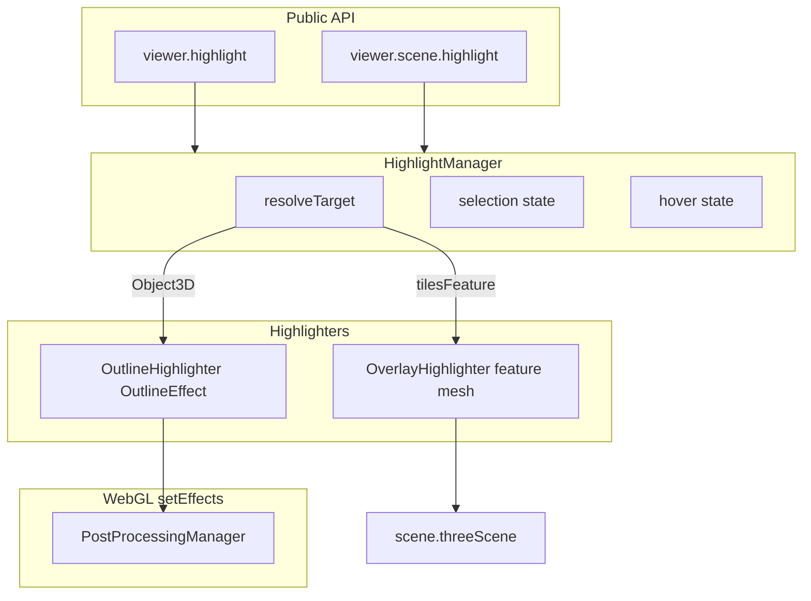

# Highlight 统一高亮方案

> 状态：设计方案（待实现）  
> 门面：`viewer.highlight`  
> 样式：`viewer.scene.highlight`

以 `viewer.highlight` 为统一门面，按目标类型自动选择后处理描边（整 Object3D）或叠加几何（3D Tiles feature）；样式挂在 `scene.highlight`，与现有 Scene 设置同构。

## 锁定决策

- 门面命名：`viewer.highlight`（非 selection）
- P0 范围：**Object3D 后处理描边** + **3D Tiles feature 叠加几何**；HISM instance 留 P1
- P0 选中语义：**单选** `set` / `clear`，另提供 `setHover` / `clearHover`（对标现有 picking 示例）
- 用户不传 `technique`；由目标类型路由后端
- Outline 仅 WebGL（接入现有 `setEffects`）；WebGPU 下 outline no-op，overlay 仍可用
- 描边实现：复用已依赖的 `postprocessing` `OutlineEffect`（`selection.add/clear`）
- 叠加实现：将 `examples/3d-tiles-picking.ts` 的 `FeatureHighlightLayer` / `createFeatureGeometry` **提升为库内模块**，示例改为调用公开 API

## 公开 API 形状

### 配置（`ViewerSceneOptions.highlight` ↔ `viewer.scene.highlight`）

```ts
scene: {
  highlight: {
    outline: {
      enabled?: boolean      // default true（WebGL）
      color?: ColorInput     // visible edge，default '#7cff5b'
      hiddenColor?: ColorInput
      edgeStrength?: number
      xray?: boolean
    },
    overlay: {
      enabled?: boolean      // default true
      color?: ColorInput     // default '#7cff5b'
      opacity?: number       // default 0.55
      hoverColor?: ColorInput
      hoverOpacity?: number
    }
  }
}
```

运行时：`viewer.scene.highlight.outline.color = ...` 等，模式对齐 `PostProcessSettings` / nested Scene settings。

不把 targets 放进 `postProcess`；Outline pass 挂载是实现细节。

### 门面（`viewer.highlight`）

```ts
type HighlightTarget =
  | THREE.Object3D
  | Picked3DTilesFeature
  | { type: 'object'; object: THREE.Object3D }
  | { type: 'tilesFeature'; feature: Picked3DTilesFeature }

viewer.highlight.set(target: HighlightTarget): void
viewer.highlight.clear(): void
viewer.highlight.setHover(target: HighlightTarget | null): void
viewer.highlight.get(): HighlightTarget | null
viewer.highlight.getHover(): HighlightTarget | null
```

便利：直接传入 `event.pick`（`ViewerPickResult`）或任意 `Object3D`（含 Entity/Model 的 root，由调用方取出）。`entity` 类型当前无高亮，会被忽略。

### 用法

```ts
viewer.on('click', (e) => {
  if (e.pick) viewer.highlight.set(e.pick)
  else viewer.highlight.clear()
})
viewer.on('mousemove', (e) => {
  viewer.highlight.setHover(e.pick)
})
```

## 架构



- `src/highlight/HighlightManager.ts`（新建）：持有 select/hover 状态；`set` 时 clear 另一 highlighter 上的旧目标，再路由
- **互斥规则（P0）**：同一通道（select 或 hover）同一时刻只激活一种 highlighter；select 与 hover 可并存（hover 不覆盖已选同一 key 时清空 hover overlay，逻辑对齐现示例）
- `src/highlight/OutlineHighlighter.ts`：包装 `OutlineEffect`，同步 `scene.highlight.outline.*` 到 effect 参数；`enabled=false` 或非 WebGL 时跳过
- `src/highlight/OverlayHighlighter.ts`：从示例迁移抽面/整 mesh/BoxHelper；`userData.telluxPickingIgnore = true`；select/hover 两套 overlay 实例（颜色/透明度不同）
- 命名不用 `*Backend`，避免与「服务端后端」语义混淆；内部实现单元统称 highlighter

## 后处理接入点

改 `src/rendering/PostProcessingManager.ts`：

- 构造期或 Viewer 注入 `OutlineEffect` 的 `EffectPassAdapter`
- 插入位置：**SymbolOcclusionPass 之后、SMAA 之前**（成图后再描边，再交给抗锯齿）
- `effectsKey` 增加 `highlight.outline.enabled`，变更时 `applyEffects()`
- **始终挂 pass、靠 selection 空集**，避免频繁 recompile；仅 `enabled` 切换才改链

## Scene / Viewer 装配

- `src/types/scene.ts`：新增 `ViewerHighlightOptions` 及子类型
- `src/scene/`：新增 `HighlightSettings`（outline/overlay nested），接入 `Scene`
- resolve 默认值写入现有 `SceneOptions` / `ResolvedSceneOptions` 路径
- `Viewer`：创建 `HighlightManager`，暴露 `get highlight()`；`destroy` 时 dispose；样式变更回调触发 outline 参数同步 / effects 重建

## 文档与示例

- 新增用户文档页（如 `docs/guide/highlight.md`）：API、Tiles 与 Object 差异、WebGPU 限制
- 改写 `examples/3d-tiles-picking.ts` 使用 `viewer.highlight`，删除示例内高亮实现
- 可选：补一个最小 Object3D 描边示例，或在现有 model 示例加 3～5 行演示
- 更新 `.agents/skills/tellux/references/interaction.md` 增加 highlight 小节

## 测试

- Overlay：用假 `Picked3DTilesFeature`（带 `_BATCHID` geometry）断言生成的高亮 mesh 三角形数 / 清理
- HighlightManager：Object3D set → outline selection 含该对象且 overlay 空；tilesFeature set → 反之
- 类型导出：`HighlightTarget` 等从 `src/index.ts` / Viewer barrel 导出

## 实现待办

1. 新增 `ViewerHighlightOptions` + `HighlightSettings`，挂到 Scene / resolve 默认值
2. 从 3d-tiles-picking 提升 OverlayHighlighter（feature 抽面 + select/hover 双层）
3. OutlineHighlighter + OutlineEffect，接入 PostProcessingManager（Symbol 后 / SMAA 前）
4. HighlightManager 路由 + Viewer.highlight 门面与 dispose
5. 文档、interaction skill、3d-tiles-picking 示例改为公开 API
6. HighlightManager / Overlay 单元测试

## 明确不在本版

- 多选 `add` / `list`
- 强制 `technique` 逃逸参数
- 把现有 `HismPickMarker` 并入 `scene.highlight.marker`（保持 HISM 内部默认行为；可用 `ViewerOptions.hism.showPickMarker` 关闭）
- HISM 描边与 PositionPipeline 风摆顶点严格同步（P2）

## P1 已落地：HISM 单实例描边

- `HighlightTarget` 支持 `HismPickResult` / `{ type: 'hismInstance', pick }`
- `HismInstanceHighlighter`：不可见 proxy（`colorWrite/depthWrite: false`）+ OutlineEffect
- `resolveInstanceParts`：active LOD 全部 archetype parts，不依赖 frustum
- 示例 `hism-forest`：关 Marker，`highlight.set(pick)`
