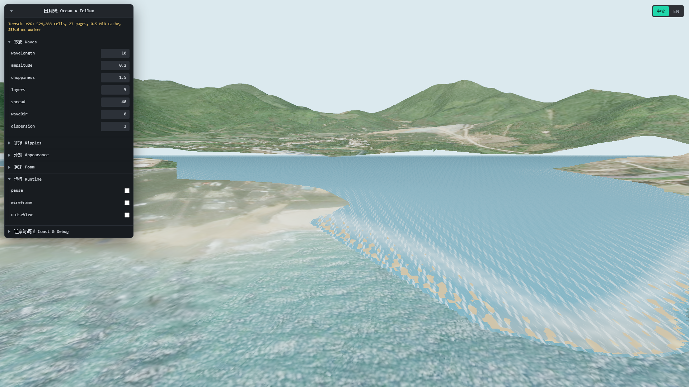

# 日月湾海洋浏览器验收记录

## 验收范围

- 日期：2026-08-20
- 页面：`examples/ocean-riyue-bay.html` 与 Sandcastle `ocean-riyue-bay`
- 视口：1920 × 1080
- 浏览器：自动化控制的桌面 Chromium，启用 WebGPU/Vulkan
- 质量：`high`

本轮自动化环境没有提供可信的物理适配器名称，因此记录不能独立证明运行设备是 RTX 3060 Ti。正式发布前若必须锁定该型号，维护者仍需在目标机器的可见 Chrome 中复采一次；其余 WebGPU、分辨率、时长和场景条件均已按验收方案执行。

## 视觉证据

截图中 Tellux Quantized Mesh 提供陆地与岸线，局部海面依据地形有效域裁切；水侧生成海床并与域边缘保留 64 米受控重叠，降低局部海洋和原影像地形之间的硬切边。

## 60 秒性能采样

预热 10 秒后连续采样 60.001 秒：

| 指标 | 结果 | 门槛 |
| --- | ---: | ---: |
| 平均帧率 | 59.75 FPS | ≥ 58 FPS |
| P95 帧时间 | 16.70 ms | ≤ 20 ms |
| 1% low | 59.52 FPS | ≥ 50 FPS |
| 采样帧数 | 3585 | — |

采样期间页面保持一个 WebGPU canvas，控制台无 error。地形场最终包含 524,288 个单元、27 个页面；页面缓存约 0.5 MiB。Worker 单次完整场合成约 261 ms，不阻塞主线程帧循环。

Renderer 总内存约 226.6 MiB，其中包括 Tellux 地形几何、ArcGIS 影像和海洋。海洋明确归属的三份浅水 StorageBuffer 为 24 MiB；再加地形场纹理、两套局部网格和材质程序，直接计数低于 64 MiB，满足海洋自有资源不超过 160 MiB 的预算。地形页面 LRU 上限仍硬限制为 64 MiB。

生产示例构建通过可选能力体积门禁；承载 ocean 可选模块的共享 chunk gzip 为 753.25 KiB，低于 1 MiB 预算。Sandcastle runner 只在源码检测到 `createRiyueBayOceanDemo` 时动态导入该模块。

## 生命周期与错误检查

- `high` / `balanced` 连续重建十次后，WebGPU storage attribute 数量保持 `3 → 3`，program 数量保持 `10 → 10`，canvas 和 Viewer 根节点均保持一个。
- Sandcastle 连续执行十次后，已修复的 `preRender` 注销异常为 0；最终 iframe 能继续形成完整地形场。
- 快速替换 iframe 会让浏览器取消旧 iframe 尚未完成的 terrain fetch，3d-tiles-renderer 会记录一次 `TypeError: Failed to fetch`。这是测试主动中断网络产生的旧 iframe 日志，稳定单次运行和最终 iframe 均无 error；不属于监听器、Worker 或 GPU 资源增长。
- 依赖库对 Tiles 1.1 的 limited support warning 为已知上游提示，不影响本案例运行。

## 结论与保留项

案例级 MVP 的地形消费、局部浅水、泡沫/焦散、水侧海床、参数面板、Sandcastle 动态加载和资源销毁已达到本期验收门槛。大气、正式太阳、全球球面 clipmap、分页 ShoreSolver、真实潮汐和 WebGL fallback 仍按 ADR 留在后续阶段。
