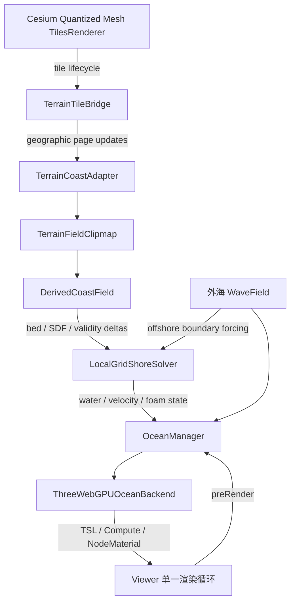
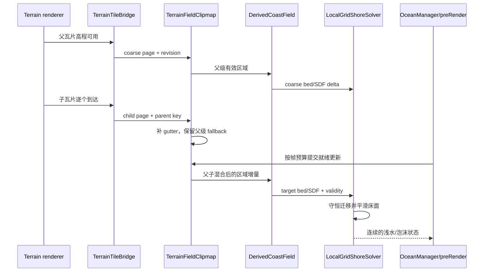

# 海洋近岸模拟与流式地形架构

> - 状态：架构决策已确认，待实现与性能定标
> - 首个案例：海南万宁日月湾高质量局部海岸场景
> - 目标平台：桌面 Chrome、WebGPU、1920 × 1080、近岸主视角稳定约 60 FPS
> - 分析依据：`D:\dev_work\gpuocean` 当前实现
> - 记录日期：2026-08-20

本文记录将 `gpuocean` 海洋效果移植到 Tellux 时，近岸模拟为什么不能直接复用原有固定程序化海岸，以及如何让海洋从首版开始消费 Tellux 动态流式 Cesium Quantized Mesh 地形，并沿同一条架构路径演进到全球海洋。

本文是维护者架构说明，不承诺首版公开 Ocean API。首版仍以 Sandcastle 案例级 MVP 交付，但内部边界必须可迁移、可测试，不能把地形瓦片生命周期、近岸求解和 Three.js WebGPU 渲染耦合成一个案例脚本。

## 已锁定的目标与边界

- 固定地点为海南万宁日月湾，优先完成高质量局部场景。
- Tellux 流式地形负责真实陆地形状，并以真实地形高程与海平面的交线决定水陆边界。
- 海侧不假设地形数据包含可靠海床；根据岸线有符号距离生成连续缓坡水深，用于浅水波增幅、破浪、泡沫和焦散。
- 海洋表面首版仍工作在局部 ENU 坐标系，但地形消费链路从第一天就使用可分块、可增量更新的契约，为全球 clipmap 留出演进路径。
- 不把原有 WebGPU 渲染重构为 WebGL。海洋接入 Tellux 的 WebGPU 模式，以 Three.js WebGPU、TSL、NodeMaterial 和 Compute 为主要执行层；必要时可通过 `wgslFn` 复用纯 WGSL 数学函数。
- Tellux 已有或上游将补齐的大气、太阳等能力不在本轮重复移植。海洋只消费场景提供的光照、相机和渲染上下文。
- 原案例可调参数应在 Sandcastle 中保留对应的视觉或物理语义，但允许适配新的近岸求解器，而不要求沿用原始内部存储布局。
- 海洋使用 Viewer 的默认单一渲染循环。Tellux 增加通用 `preRender` 事件，供海洋在内置更新和地形 LOD 选择之后、场景绘制之前提交本帧更新。

## `gpuocean` 现有近岸模型

`gpuocean` 的外海波浪与近岸薄水层实际上是两套不同拓扑的系统。

### 外海波浪

`WaveField` 通过滚动噪声纹理近似波谱，叠加重力波、毛细波和 choppiness。其状态主要定义在世界/海面坐标中，与某一条岸线的顶点编号没有强绑定。地形主要参与以下末端效果：

- 浅水衰减与波高变化；
- 水陆裁切；
- 破浪和白沫触发；
- 焦散和水线过渡。

因此，波谱、外海位移、材质光照以及相当一部分世界空间泡沫逻辑可以继续复用或按 TSL 重表达。

### `ChainSim` 与岸线 ribbon

原近岸系统围绕固定程序化海岸建立：

- `src/coast.js` 生成一条固定大陆岸线和固定岛屿轮廓，并预烘焙 SDF、弧长和法线表。
- `src/chain.js` 使用固定 `COLS = 256`、`NODES = 64` 的状态纹理。每个沿岸列是一条一维跨岸浅水链，保存位置、速度、体积和水面状态。
- `shaders/wave_common.wgsl` 把岸线列号、固定 SDF、固定坡度和模拟纹理绑在一起。
- `shaders/ocean.wgsl` 的 ribbon 顶点直接由岸线弧长列、岸点、岸线法线和 Chain 状态生成。
- `shaders/filmfoam.wgsl` 在 `(band, column)` 材质空间积累薄水泡沫历史；它依赖岸线列身份在相邻帧保持不变。

这一结构在固定程序化岸线下很高效：岸线窗口移动时可以按行复制状态，列号仍代表同一条连续海岸。但它隐含了一个关键前提：**岸线拓扑、弧长参数化和跨岸坡面在模拟生命周期内基本不变。**

## 动态 Terrain LOD 带来的根本冲突

Tellux 地形由 Cesium Quantized Mesh 瓦片动态加载。父瓦片先提供粗略地形，子瓦片随后逐级替换局部区域。LOD 提升不只是增加顶点，它可能改变：

- 海平面零等值线的位置和方向；
- 岸线法线与弧长参数化；
- 海湾、沙洲、河口、礁石和岛屿的出现、消失、分裂或合并；
- 相邻瓦片边界处可用于求 SDF 的邻域信息。

如果每次地形 LOD 更新都重建 ChainSim 与 ribbon，会产生以下问题。

### 状态身份丢失

旧的第 `j` 个沿岸列和新岸线的第 `j` 个沿岸列不再对应同一世界位置。简单复制纹理行会把速度、浪尖、薄水体积和泡沫历史瞬移到另一段海岸。

### 非物理压力脉冲

`ChainSim` 的体积状态建立在固定坡度和旧岸线剖面上。当真实地形或生成海床变化后，旧体积不再是新床面的平衡态。直接保留状态会制造虚假的压力脉冲和 run-up；完全重置又会让已有浪和泡沫突然消失。

### 几何与模拟无法原子切换

ribbon 顶点、岸线查找表、Chain 状态和薄水泡沫使用同一套列编号。它们只要有一项先切到新 LOD，就可能出现裂缝、重叠、错误水线或泡沫错位。

### 瓦片边界缺少上下文

单个子瓦片到达时通常没有完整邻域。如果仅在该瓦片范围内独立求岸线和 SDF，边缘会产生错误法线、断裂等值线和随瓦片到达顺序变化的拓扑。

因此，**不能把“瓦片更新后反复销毁并重建固定岸线 ChainSim/ribbon”作为 Tellux 接入方案。** 这不是调几个 blend 参数能解决的问题，而是模拟状态拓扑与动态地形数据模型不兼容。

## 架构决策

保留 `gpuocean` 外海波浪的视觉与参数语义，替换其固定岸线近岸状态拓扑：首版使用世界固定的 `LocalGridShoreSolver`，由可增量更新的 `TerrainFieldClipmap` 提供床面和岸线派生场。



### `OceanManager`

案例内部的海洋总协调器，负责：

- 海洋资源和计算 pass 生命周期；
- 外海 `WaveField`、近岸求解器和渲染后端的时序；
- 接收 `preRender`，限制每帧地形派生更新预算并推进模拟；
- 向 Sandcastle 参数面板暴露案例级设置；
- 在销毁时解除 Viewer 事件、释放 GPU 资源。

它不直接读取 Tellux 私有地形集合，也不持有 Cesium 瓦片对象。

### `TerrainCoastAdapter`

海洋与 Tellux 地形系统之间的防腐层，负责把地形生命周期转换为稳定的数据契约：

- 将经纬范围、层级、父键、版本和高程页转换为 clipmap 更新；
- 处理 Tellux 地理坐标到局部 ENU 的映射；
- 隔离 `3d-tiles-renderer`、Quantized Mesh 插件和 Tellux 内部接口变化；
- 只发送地形场增量，不向求解器泄露 Three.js Mesh 或瓦片实现对象。

### `TerrainTileBridge`

从地形渲染器获得瓦片增删和可见性变化。实现时应优先基于 `3d-tiles-renderer` 的公开生命周期，例如 `load-model`、`dispose-model`、`tile-visibility-change` 和 Quantized Mesh 插件的模型处理钩子；不要依赖 `activeTiles` 等内部集合。

瓦片被渲染器卸载后，海洋可以在自己的有界 LRU 中短期保留紧凑的高程页，但不能为了海洋长期持有完整地形 Mesh，干扰 Tellux 原有瓦片资源生命周期。

### `TerrainFieldClipmap`

维护海洋所需的分层地形场，而不是复制一套地形渲染器：

- 父瓦片先到时立即提供粗粒度 page；
- 子瓦片到达后只更新其覆盖区域；
- 子 page 完整可用之前继续使用父级 fallback；
- 父子高程及其派生岸线场采用时间/空间渐变，避免瞬时切换；
- page 包含 gutter/halo，并在邻页到达后修复边界；
- 更新队列在 `preRender` 中按预算消费，避免某一帧集中重算破坏 60 FPS；
- 数据身份使用地理范围、层级、父键和 revision，而不是局部数组下标。

首版 clipmap 的兴趣区固定覆盖日月湾；未来可改为随相机移动的球面/地理 clipmap，而不改变上层海洋接口。

### `DerivedCoastField`

由地形高程和海平面派生近岸输入，至少包含：

- `landMask`：真实地形高程是否高于海平面；
- `shoreSdf`：到稳定岸线的有符号距离；
- `bedHeight`：陆侧沿用真实地形，海侧由岸线距离生成连续缓坡海床；
- `validity` / `revision`：标记数据来源层级和更新批次。

海侧目标床面可概念化为：

```text
bedHeight = -bathymetryCurve(max(0, -shoreSdf))
```

具体曲线、最大水深和过渡尺度由案例参数控制。岸线附近必须保证位置和一阶变化足够连续，避免焦散、法线和浅水波出现瓦片格状突变。

SDF 不能在无邻域的单页内独立计算。派生场需要 halo，并允许邻页或更高 LOD 到达后以新 revision 增量修正。

### `LocalGridShoreSolver`

首版近岸模拟采用固定在日月湾局部 ENU 世界空间中的规则网格。每个单元始终代表同一世界区域，状态不再依赖岸线弧长列号。建议状态至少包括：

- 床面高程；
- 水深或水层厚度；
- 二维水平速度；
- wet/dry 状态；
- 近岸泡沫历史。

当 Terrain LOD 更新时，仅修改受影响网格单元的目标床面和岸线派生量，并在若干帧内平滑过渡。求解器需要采用守恒且尽量 well-balanced 的床面更新策略，避免静水面因床面细化产生假波，同时明确多余或缺失水体积的处理规则。

外海波谱不进入整片高成本浅水求解。`WaveField` 在海侧边界为近岸网格提供波高、相位或流速强迫；只有岸线附近运行 wet/dry、run-up、破浪和泡沫演化。

`LocalGridShoreSolver` 的输入契约应是通用地形场增量，不应依赖 Tellux、Three.js 或 Cesium tile ID。未来全球化时，可把相同单元模型拆为稀疏 `TiledShoreSolver`：只在相机附近和有效岸带分配页，远海继续使用波谱表面。

### `ThreeWebGPUOceanBackend`

渲染后端负责把海洋状态映射到 Three.js WebGPU 资源、TSL、NodeMaterial 和 Compute。它是唯一允许接触渲染器能力差异的模块。

不以 `renderer.backend.device` 作为海洋绘制的常规入口。直接操作底层 `GPUDevice` 会绕过 Three.js 的资源、管线、绑定和版本适配层，增加与 Three.js 内部实现的耦合。只有在 TSL/NodeMaterial 确实无法表达且收益经过验证时，才考虑受控的底层逃逸，并把它继续封装在 backend 内。

## Terrain LOD 更新流程

一次父子瓦片细化的预期流程如下：



关键不变量：

1. 地形 LOD 变化不能改变模拟单元的世界身份。
2. 不完整子页不能抢先覆盖完整父页。
3. 岸线、床面、法线和 SDF 应来自同一 revision，或在明确的混合阶段中共同过渡。
4. 泡沫历史跟随世界网格状态，而不是跟随新生成的岸线顶点编号。
5. 地形更新有每帧预算；镜头与海浪主循环的帧时间优先级高于立即追平所有新瓦片。

## 为什么不选择其他方案

### 一次性最高精度地形快照

优点是岸线稳定、实现简单，也最接近原固定海岸模型。但它不能响应 Terrain LOD 和区域切换，后续全球化仍需重写地形消费链路。该方案已否决。

### 动态重参数化的 ribbon/ChainSim

理论上可以在岸线变化后重新提取轮廓，并把旧 Chain 状态投影到新弧长。但真实岸线会分裂、合并、产生岛屿和河口；状态守恒、泡沫迁移和双拓扑过渡都非常复杂。该方案能保留更多原代码，却会把大量复杂度集中在脆弱的轮廓匹配上，也不利于全球分块。该方案已否决。

### 世界固定局部网格

它比直接复用 ChainSim 增加了首版工作量，但 Terrain LOD 只改变网格输入，不改变状态身份；日月湾局部网格和未来全球稀疏分块也能沿同一数据模型演进。因此选择该方案。

## 决策后果与工程代价

正向后果：

- Terrain LOD、岸线提取和近岸状态之间形成明确边界，Three.js、Tellux 地形接口或海洋渲染实现变化不会扩散到整个系统。
- 模拟状态拥有稳定的世界身份，地形细化可以增量吸收，泡沫和 run-up 历史不必跟随岸线顶点重建。
- 局部日月湾与未来全球岸带共享 page、增量和求解单元模型，全球化是分块与调度扩展，而不是第二次推翻近岸架构。
- 原外海波浪和材质优势得以保留，高成本浅水计算只覆盖近岸有效区域。

需要接受的代价：

- 这不是对 `ChainSim` 和 ribbon 的机械移植，而是保留视觉/参数意图、重新实现近岸物理状态拓扑。
- 首版需要同时解决 wet/dry 边界、守恒床面更新、CFL/substep、page halo、父子 LOD 混合和 GPU 资源调度，工作量高于固定岸线 demo。
- `TerrainFieldClipmap` 与 `LocalGridShoreSolver` 都需要独立的调试可视化和指标，否则岸线接缝、质量损失或帧预算超支很难定位。
- 全球扩展仍需要球面寻址、稀疏 page 调度、跨 page 通量和相机重定位策略；当前方案提供演进边界，但不声称首版已经实现全球求解。

主要风险及控制方向：

- 若地形 LOD 变化幅度过大，单纯线性平滑仍可能制造或吞噬水体；必须记录质量误差，并设计守恒迁移规则。
- 若 SDF 和床面派生集中在主线程/单帧执行，会破坏 60 FPS；应设置更新预算，并比较 CPU、Web Worker 与 WebGPU Compute 路径。
- 若局部网格覆盖过大，浅水求解成本不可控；应把有效岸带掩码、质量档位和未来稀疏 page 作为一等设计约束。
- 若通用 Tellux 扩展点泄露 Ocean 特例，会形成新的库级债务；公开能力只提供稳定的帧阶段和地形生命周期，不暴露海洋内部概念。

## 参数迁移原则

Sandcastle 应保留原案例可调能力，但参数属于领域语义，不属于旧实现纹理布局。迁移时分三类处理：

- 直接保留：风浪尺度、波向、重力波/毛细波、choppiness、海水颜色、Fresnel、散射、泡沫强度等与外海或材质直接相关的参数。
- 语义映射：原固定坡度、静水深、run-up、薄水泡沫等参数，映射为海床曲线、近岸求解器、wet/dry 和泡沫历史参数。
- 内部化：`COLS`、`NODES`、固定 ribbon span、固定岸线表尺寸等实现常量不作为用户参数原样暴露；用局部求解范围、网格分辨率、质量档位和更新预算表达。

具体参数名、默认值和分组在实现规格中单独锁定，初始化配置与运行时面板使用同一份状态源，避免 UI 参数与模拟参数形成双状态。

## 首版职责边界

```text
Tellux library
├─ Viewer 通用 preRender 事件
├─ 原有 WebGPU renderer / scene / terrain 生命周期
└─ 必要的、与 Ocean 无关的地形生命周期扩展点

Sandcastle ocean example（首版私有）
├─ OceanManager
├─ TerrainCoastAdapter / TerrainTileBridge
├─ TerrainFieldClipmap / DerivedCoastField
├─ LocalGridShoreSolver
├─ ThreeWebGPUOceanBackend
└─ 参数面板与日月湾场景配置
```

除 `preRender` 和确有复用价值的通用地形扩展点外，不急于把 Ocean 类型放入 `src/index.ts`。待案例经过画质、LOD 连续性和性能验证后，再决定哪些边界适合形成 Tellux 公开 API。

## 首版验收重点

- 日月湾真实地形轮廓决定水陆边界，不能用手绘固定海岸替代。
- 父子地形 LOD 切换时，水线、浅水波、run-up 和泡沫历史无明显跳变或瞬移。
- 相邻瓦片异步到达时，岸线/SDF 不出现持续裂缝和瓦片格状接缝。
- 外海到浅水区的波形、破浪、泡沫、焦散和材质过渡连续。
- 原案例主要可调参数在 Sandcastle 中可操作，并有合理分组和默认值。
- 使用 Viewer 单一循环，没有海洋自建 `requestAnimationFrame` 或抢占 renderer。
- 桌面 Chrome、WebGPU、1920 × 1080、近岸主视角稳定约 60 FPS；地形更新峰值需单独记录帧时间和更新队列积压。
- 资源销毁后无残留 Viewer 监听、GPU 纹理、计算资源或被海洋长期持有的地形 Mesh。

## 已锁定的首版实现基线

### Tellux 扩展边界

- `viewer.on('preRender', listener)` 在所有内置状态更新完成后、最终场景绘制前触发；默认循环与手动 `viewer.render()` 共用同一时序。
- `viewer.terrain` 是分组运行时 facade，负责地形切换、只读瓦片观察和受控材质装饰；`viewer.setTerrain()` 保留为兼容别名。
- 瓦片观察只暴露地理范围、父子身份、LOD 元数据和只读 `Object3D`，不暴露 3d-tiles-renderer 的 Tile 对象。
- `load` 后调用方必须同步复制需要的 Buffer 数据。原始模型、材质和几何始终由 Tellux 管理，不能转移、销毁或通过观察接口修改。
- Cesium 海侧地形可能仍存在接近海平面的网格。海洋通过通用 `addMaterialDecorator()` 返回替换材质，在局部海域内裁掉水侧地形；装饰器注销或瓦片卸载时由 Tellux 恢复原材质并释放装饰资源。

### 日月湾局部域

- 中心为 `[110.2148756, 18.6296934]`，局部坐标沿岸方向约 `68°`，`+X` 指向海侧、`+Z` 沿岸。
- 固定域沿岸 `2048m`、跨岸 `1024m`，约覆盖 `256m` 陆侧和 `768m` 海侧。
- `high` 使用 `1024 × 512` 岸线场、`512 × 512` 海面网格和 `512²` 泡沫场；`balanced` 使用 `512 × 256` 岸线场、`384 × 384` 海面网格和 `256²` 泡沫场。
- 地形优先使用 `VITE_CESIUM_TERRAIN_URL`，否则使用 Cesium Ion asset 1 或 `VITE_CESIUM_ION_TERRAIN_ASSET_ID`。凭据缺失时明确报错，不回退到天地图或 WebGL。
- 以多个已知沙滩点的 `sampleHeightMostDetailed` 中位数校准海平面垂直基准；面板中的 `seaLevel` 是其上的潮位偏移，真实地形高程仍决定最终岸线。

### 地形场与近岸求解

- 地形瓦片栅格化为带有效位和 gutter 的 `65 × 65` 高度页。子页完整前使用父页，父子 revision 在 `1.5s` 内共同过渡。
- land mask 使用 `0.15m` Schmitt hysteresis；岸线 SDF 使用带邻域的精确欧氏距离变换。
- 水侧床面使用 `bed = seaLevel - maxDepth * (1 - exp(-bathymetrySlope * distance / maxDepth))`，默认坡度 `0.035`；陆侧保持真实地形高程。
- `LocalGridShoreSolver` 使用二维浅水守恒变量 `(h, hu, hv)`、HLL 通量、hydrostatic reconstruction、wet/dry 和 positivity 约束。
- CFL 系数为 `0.45`，单步最大 `1/30s`，每帧最多四个子步；超额模拟时间丢弃，不突破稳定条件。
- 海侧设置谱波松弛带，沿岸使用辐射/零梯度边界。LOD 改床时保持旧自由液面 `eta`，并记录 `terrainCorrectionVolume`，避免细化制造假浪。

### 资源、失败与性能边界

- 地形页面 LRU 上限 `64MB`，海洋 GPU 资源目标不超过 `160MB`；地形主线程更新 P95 不超过 `2ms`。
- 不完整初始覆盖隐藏近岸水面，不猜测岸线；Worker 失败保留上一份完整 revision；地形 reset 清空场和 solver，等待新源恢复。
- 目标环境为桌面 Chrome WebGPU、1920 × 1080、RTX 3060 Ti、`high` 档；60 秒采样平均至少 `58 FPS`、P95 帧时间不高于 `20ms`、1% low 不低于 `50 FPS`。
- 视觉截图不能替代 LOD 连续性、资源销毁和帧时间验证。浏览器验收必须记录 console、网络、性能 trace 和十次销毁重建结果。

## 全球演进路径

首版局部域不是一次性实现。全球化时保留 `TerrainTileSnapshot`、地理高度 page、revision、父级 fallback、世界身份稳定的求解单元和外海 `WaveField`，把固定域调度替换为相机跟随的球面/ENU clipmap，并把 `LocalGridShoreSolver` 扩展为稀疏 `TiledShoreSolver`。需要新增的是球面寻址、跨 page 通量、兴趣区迁移和远近岸调度，而不是再次重写地形消费协议。
