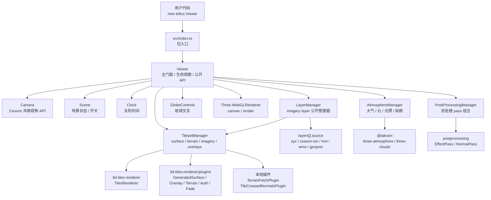
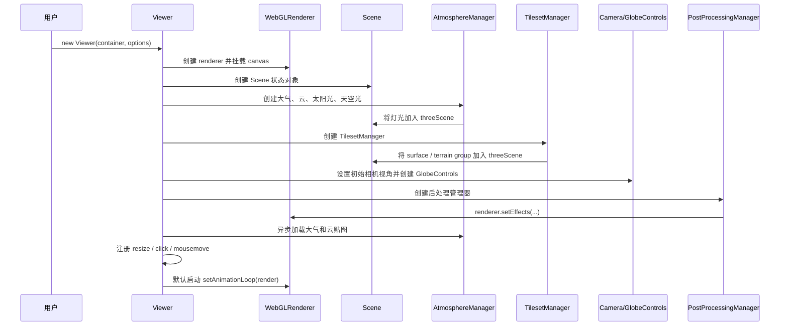
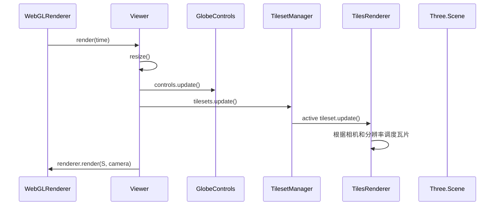
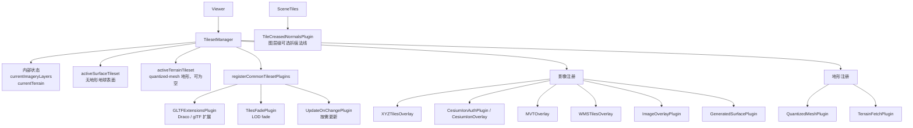

# Tellux 项目架构

本文档说明 Tellux 当前源码架构、主要模块职责，以及从 `Viewer` 创建到画面渲染过程中各模块的协作方式。重点补充 `TilesetManager` 的内部结构和工作流程。

## 总体架构

Tellux 采用 `Viewer` 门面加内部 manager 的结构。用户侧主要接触 `Viewer`、`Camera`、`Scene`、`Clock`、`viewer.layers` 和 `layers[].source` 数据源配置对象；内部由不同 manager 分别管理瓦片、影像图层、地形、大气、云和后处理。

## 模块职责

- `src/Viewer.ts`：主门面类。负责创建核心对象、启动默认渲染循环、转发公开 API、处理 resize、事件、拾取和销毁。
- `src/LayerManager.ts`：影像图层管理器。负责影像图层的增删、显隐、样式和顺序，并把变化同步给 `TilesetManager`。
- `src/Camera.ts`：相机控制封装。提供 `setView`、`flyTo`、`getState` 等 Cesium 风格视角方法。
- `src/Scene.ts`：场景状态对象。维护云、大气、后处理阶段开关和云参数，状态变化时触发后处理重组。
- `src/Clock.ts`：太阳时间状态。`currentTime` 或 `hourUTC` 变化时通知大气模块更新太阳方向。
- `src/tiles/TilesetManager.ts`：瓦片和渲染管线管理器。负责地球表面、地形、影像 overlay 注册、插件注册、热切换、每帧 tileset 更新。
- `src/rendering/AtmosphereManager.ts`：大气和云管理器。负责创建大气、云、太阳光、天空光，并加载云纹理和 STBN 资源。
- `src/rendering/PostProcessingManager.ts`：后处理管理器。根据 `Scene` 状态组合 normal pass、大气云 pass、lens flare、SMAA、dithering。

## Viewer 创建流程

`Viewer` 构造函数里先创建 renderer、camera、scene 和 atmosphere，再创建 `TilesetManager`。这是因为 `TilesetManager` 需要 Three.js scene、camera、renderer、Draco loader 和透明 overlay fallback texture。创建完成后，`Viewer` 把相机设置到初始经纬高位置，再创建 `GlobeControls` 并绑定 `TilesetManager.surfaceTileset` 的 ellipsoid。最后创建 `LayerManager`，把 `options.layers` 转成可控制的 `ImageryLayer` 句柄，并在图层变化时同步给 `TilesetManager`。

## 每帧渲染流程

`TilesetManager.update()` 只更新当前活动 tileset。启用地形时，活动 tileset 是 terrain tileset；未启用地形时，活动 tileset 是 surface tileset。这样可以避免无地形表面和地形同时参与瓦片调度。

## TilesetManager 架构

`TilesetManager` 是 Tellux 数据层和瓦片层的核心。它不直接暴露给用户，而是由 `Viewer` 持有并通过公开 API 转发调用。

### 内部状态

`TilesetManager` 维护三类状态：

- `activeSurfaceTileset`：基础地球表面 tileset。无地形模式下它是可见且被更新的活动 tileset。
- `activeTerrainTileset`：地形 tileset。启用地形时存在；禁用地形时为 `null`。
- `currentImageryLayers`、`currentTerrain`：记录当前影像图层和地形配置，用于热切换时重建 tileset。

对外只暴露三个 getter：

- `tileset`：当前活动 tileset，优先返回 terrain，否则返回 surface。
- `surfaceTileset`：基础地球表面 tileset，供控制器 ellipsoid 和椭球拾取使用。
- `terrainTileset`：当前地形 tileset，供地形优先拾取使用。

### 初始化逻辑

初始化时，`TilesetManager` 会：

1. 保存 `layers` 和 `terrain` 当前配置。
2. 创建 `activeSurfaceTileset`。
3. 将 `activeSurfaceTileset.group` 加入 Three.js scene。
4. 如果传入 `terrain`，创建 `activeTerrainTileset` 并加入 scene。
5. 调用 `syncSurfaceVisibility()`：有地形时隐藏 surface，无地形时显示 surface。
6. 调用 `syncActiveTilesetReference()`：把当前活动 tileset 写入 `camera.userData.tilesRenderer`，供 `Camera` 根据 ellipsoid 计算经纬高视角。

### Surface tileset 创建

`createSurfaceTileset(layers)` 用于无地形地球表面：

- 始终注册 `GeneratedSurfacePlugin({ shape: 'ellipsoid' })` 创建基础椭球表面。
- 有可见影像图层时，通过 `ImageOverlayPlugin` 把 overlay stack 贴到椭球表面。
- 最后统一调用 `registerCommonTilesetPlugins()` 注册通用插件和相机分辨率。

Surface 的典型用途是无地形模式下显示基础椭球地球。即使没有 layers、也没有 terrain，它也会照常创建裸球，用于控制器 ellipsoid 和椭球 fallback 拾取。

### Terrain tileset 创建

`createTerrainTileset(terrain, layers)` 用于 Cesium quantized-mesh 地形。`terrain` 支持 URL 地形和 Cesium Ion 地形：

- URL 地形先通过 `normalizeTerrainUrl()` 把 terrain URL 归一到根目录，再注册 `QuantizedMeshPlugin` 和 `TerrainFetchPlugin`。
- Cesium Ion 地形先注册 `CesiumIonAuthPlugin`，由 Ion endpoint 确认 asset type 为 `TERRAIN` 后再注册 `QuantizedMeshPlugin`。
- 通过 `registerTerrainImagery()` 把可见影像图层作为 `ImageOverlayPlugin` 叠加到地形表面。
- 最后同样注册通用插件、相机和分辨率。

地形模式下，terrain tileset 成为活动 tileset；surface tileset 保留在 scene 中但隐藏。

### 影像图层策略

`LayerManager` 只管理 imagery layer。`source` 描述数据来源和加载协议，图层自身保存名称、显隐、顺序和显示样式。`TilesetManager` 当前支持五类 imagery source：

- `xyz`：通过 `XYZTilesOverlay` 贴到裸球或地形表面。
- `cesium-ion`：通过 `CesiumIonOverlay` 贴到裸球或地形表面。
- `mvt`：通过 `MVTOverlay` 转成可贴到地球或地形表面的影像 overlay。
- `wms`：通过 `WMSTilesOverlay` 加载 WMS GetMap 图片瓦片，并贴到裸球或地形表面。
- `geojson`：通过 `GeoJSONOverlay` 转成可贴到地球或地形表面的影像 overlay。

当 MVT overlay 暂时没有 texture 时，`createMVTOverlay()` 会返回透明 fallback texture，避免 overlay 缺失导致渲染链路拿到 `null`。

### 热切换工作方式

`LayerManager` 的 `add()`、`remove()`、`removeAll()`、`move()`、`ImageryLayer.setVisible()` 和 `ImageryLayer.setStyle()` 会触发内部 `TilesetManager.setImageryLayers()`：

1. 更新 `currentImageryLayers`。
2. 重建 surface tileset。
3. 如果当前有 terrain，也重建 terrain tileset。
4. 同步可见性、活动引用和分辨率。

`setTerrain()`：

1. 更新 `currentTerrain`。
2. 传入 terrain 时创建新的 terrain tileset；传入 `null` 时移除 terrain tileset。
3. 同步 surface 可见性和活动 tileset 引用。

热切换采用“创建新 tileset -> 从 scene 移除旧 group -> dispose 旧 tileset -> 加入新 group”的方式。这样实现简单、状态清晰，也能保留 `Viewer`、renderer、camera 和 controls 实例不变。

### 与 Viewer 的配合

`Viewer` 调用 `TilesetManager` 的位置主要有：

- 构造阶段：创建 `TilesetManager`，并把 `scene`、`camera`、`renderer`、`dracoLoader` 等依赖传入。
- `layers`：创建 `LayerManager`，图层变化时转发给 `tilesets.setImageryLayers()`，随后同步 controls ellipsoid。
- `setTerrain()`：转发给 `tilesets.setTerrain()`。
- `render()`：每帧调用 `tilesets.update()`。
- `resize()`：尺寸变化时调用 `tilesets.resize()`。
- `pickCartographic()`：优先拾取 `tilesets.terrainTileset`，失败后拾取 `tilesets.surfaceTileset`，最后 fallback 到 surface ellipsoid。
- `destroy()`：调用 `tilesets.dispose()` 释放 tileset 资源。

### 扩展方向

后续新增数据源时，推荐遵循以下边界：

- TypeScript option 类型继续维护在 `src/types.ts`，通过 discriminated union 扩展 `ImageryLayerSourceOptions`。
- 数据源到 3d-tiles-renderer plugin / overlay 的转换逻辑放在 `TilesetManager` 或进一步拆出的 imagery factory 中。
- 加载参数保留在 `source`，图层显示和矢量符号化保留在 `style`。
- 如果新增能力会改变 terrain/surface 创建流程，优先补充 `TilesetManager` 文档和对应示例。

当 `TilesetManager` 继续增长时，可以进一步拆出：

- `ImageryOverlayFactory`：专门处理 xyz、Cesium Ion、MVT、WMS、WMTS、TMS、GeoJSON 等 source 到 overlay/plugin 的转换。
- `TerrainTilesetFactory`：专门处理 quantized-mesh、地形 URL、地形插件和地形影像。
- `SurfaceTilesetFactory`：专门处理无地形地球表面和 `GeneratedSurfacePlugin`。

这样可以继续保持 `Viewer` 简洁，同时避免 `TilesetManager` 变成新的大类。
